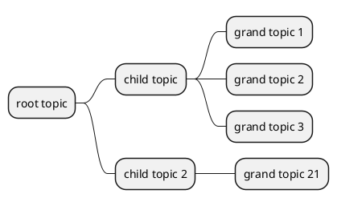
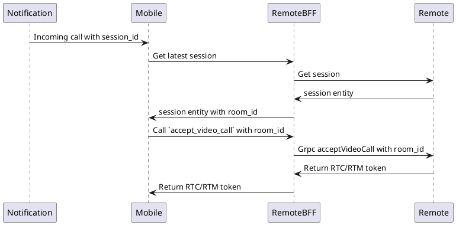

Case user start call by new API, then incoming call to the old app. **Old app will call to get room_id from session** so where do we get room_id? 
+ Generate if there are no room_id yet?
+ Change room_id by session_id in old  flow? so how do we know when it be room_id?

Mobile chỉ cần cái 
-> Session hasn't had room_id