 

  

```mermaid

graph TB

subgraph "Client Layer"

CLIENT[GraphQL Client<br/>Web Application]

end

  

subgraph "Entry Point"

MAIN[main.go<br/>Application Bootstrap]

PROVIDERS[Service Providers<br/>app/providers/*]

end

  

subgraph "HTTP Layer - Port 4000"

GRAPHQL_SERVER[GraphQL Server<br/>github.com/99designs/gqlgen<br/>framework/router/graphql]

end

  

subgraph "HTTP Middlewares"

RATE_LIMIT[Rate Limiting<br/>interface/middlewares/graphql/rate_limiting.go<br/>Max Requests Per Second]

CORS_MW[CORS<br/>interface/middlewares/graphql/cors.go<br/>Cross-Origin Policy]

end

  

subgraph "GraphQL Middlewares"

LOG_MW[Logging<br/>interface/middlewares/graphql/log.go<br/>Request/Response Logging]

TRACING_MW[Tracing<br/>interface/middlewares/graphql/tracing.go<br/>Distributed Tracing]

AUTH_MW[Authentication<br/>interface/middlewares/graphql/auth.go<br/>Session Validation]

RECOVERY_MW[Recovery<br/>interface/middlewares/graphql/recovery.go<br/>Panic Recovery]

DATALOADER_MW[DataLoaders<br/>interface/middlewares/graphql/dataloader.go<br/>N+1 Query Prevention]

end

  

subgraph "Interface Layer - interface/"

SCHEMA[GraphQL Schema<br/>interface/graph/schema/*.graphqls<br/>Type Definitions]

RESOLVER[Resolver<br/>interface/graph/resolver/resolver.go<br/>Query/Mutation Handler]

  

subgraph "Controllers - interface/resources/*/graphql/v1"

AUTH_CTRL[AuthController<br/>Login/Logout/User]

ACTIVITY_CTRL[ActivityController<br/>Activity Management]

EMAIL_CTRL[EmailController<br/>Inbox Operations]

CRM_CTRL[CRMController<br/>Contact Files]

DRIVE_CTRL[DriveController<br/>File Operations]

SYNC_CTRL[ExternalSyncController<br/>Integration Management]

KB_CTRL[KnowledgeBaseController<br/>KB Sources]

end

end

  

subgraph "Domain Layer - domain/"

subgraph "Services - domain/*/services"

AUTH_SVC[Auth Services<br/>session.Service<br/>user.Service]

ACTIVITY_SVC[Activity Service<br/>activity.Service]

EMAIL_SVC[Email Services<br/>thread/email/envelope<br/>address.Service]

CRM_SVC[CRM Service<br/>file.Service]

DRIVE_SVC[Drive Service<br/>file.Service]

SYNC_SVC[External Sync Services<br/>connection/synchronization<br/>transaction/kintone]

KB_SVC[KB Service<br/>source.Service]

end

  

subgraph "Models - domain/*/models"

DOMAIN_MODELS[Domain Models<br/>User, Session, Activity<br/>Email, Contact, File<br/>Connection, Transaction]

end

  

subgraph "Adapters - domain/*/adapters"

DOMAIN_ADAPTERS[Domain Adapters<br/>Interface to Infra Layer]

end

end

  

subgraph "Infrastructure Layer - infra/"

subgraph "Digima Client - infra/digima"

DIGIMA_CLIENT[Digima API Client<br/>digima-backend-client-go/v5<br/>HTTP REST Client]

DIGIMA_ENDPOINTS[Multiple Endpoints:<br/>- OAuth API<br/>- Contact API<br/>- Profile API<br/>- Account API<br/>- Activity API<br/>- Email API<br/>- Internal API]

end

  

subgraph "Cache Layer - infra/cache"

REDIS[Redis Client<br/>Session & Data Cache]

FREECACHE[FreeCache<br/>In-Memory Cache<br/>github.com/coocood/freecache]

end

  

subgraph "Auth Infrastructure - infra/auth"

TOKEN_CLIENT[Token Client<br/>JWT/OAuth Token Management]

end

  

subgraph "Drive Infrastructure - infra/drive"

FILE_CLIENT[File Client<br/>File Upload/Download]

end

  

subgraph "External Sync - infra/external_sync"

SYNC_INTEGRATIONS[Integrations:<br/>- Kintone<br/>- Other External Systems]

end

  

subgraph "KB Infrastructure - infra/kb"

KB_CLIENT[Knowledge Base Client<br/>KB API Integration]

end

end

  

subgraph "External Services"

DIGIMA_BACKEND[Digima Backend APIs<br/>Core Business Services<br/>REST APIs]

AUTH_API[Auth API<br/>OAuth 2.0 Server<br/>Token Management]

EMAIL_SVC_EXT[Email Service<br/>SMTP/IMAP]

KB_API[Knowledge Base API<br/>Document Management]

EXTERNAL_SYSTEMS[External Systems<br/>Kintone, etc.]

end

  

subgraph "Data Storage"

REDIS_DB[(Redis<br/>Session Storage<br/>Cache Layer)]

MEMORYDB[(MemoryDB<br/>In-Memory Data)]

end

  

subgraph "Config & Framework"

CONFIG[Configuration<br/>app/config/*<br/>- app, auth, cache<br/>- cors, email, file<br/>- kb, router, log]

FRAMEWORK[Backend Service Framework<br/>github.com/comvex-jp/<br/>backend-service-go-framework/v7]

VALIDATOR[Validator<br/>Request Validation]

end

  

%% Request Flow

CLIENT -->|1. GraphQL Request| GRAPHQL_SERVER

MAIN -.->|Bootstrap| PROVIDERS

PROVIDERS -.->|Initialize| GRAPHQL_SERVER

PROVIDERS -.->|Configure| CONFIG

CONFIG -.->|Inject| GRAPHQL_SERVER

  

GRAPHQL_SERVER -->|2. HTTP Layer| RATE_LIMIT

RATE_LIMIT -->|3.| CORS_MW

  

CORS_MW -->|4. GraphQL Layer| LOG_MW

LOG_MW -->|5.| TRACING_MW

TRACING_MW -->|6.| AUTH_MW

AUTH_MW -->|7.| RECOVERY_MW

RECOVERY_MW -->|8.| DATALOADER_MW

  

DATALOADER_MW -->|9. Route to Resolver| RESOLVER

RESOLVER -->|10. Delegate| AUTH_CTRL

RESOLVER -->|10. Delegate| ACTIVITY_CTRL

RESOLVER -->|10. Delegate| EMAIL_CTRL

RESOLVER -->|10. Delegate| CRM_CTRL

RESOLVER -->|10. Delegate| DRIVE_CTRL

RESOLVER -->|10. Delegate| SYNC_CTRL

RESOLVER -->|10. Delegate| KB_CTRL

  

AUTH_CTRL -->|11. Validate & Transform| VALIDATOR

AUTH_CTRL -->|12. Call Service| AUTH_SVC

ACTIVITY_CTRL -->|12. Call Service| ACTIVITY_SVC

EMAIL_CTRL -->|12. Call Service| EMAIL_SVC

CRM_CTRL -->|12. Call Service| CRM_SVC

DRIVE_CTRL -->|12. Call Service| DRIVE_SVC

SYNC_CTRL -->|12. Call Service| SYNC_SVC

KB_CTRL -->|12. Call Service| KB_SVC

  

AUTH_SVC -->|13. Use Adapter| DOMAIN_ADAPTERS

ACTIVITY_SVC -->|13. Use Adapter| DOMAIN_ADAPTERS

EMAIL_SVC -->|13. Use Adapter| DOMAIN_ADAPTERS

CRM_SVC -->|13. Use Adapter| DOMAIN_ADAPTERS

DRIVE_SVC -->|13. Use Adapter| DOMAIN_ADAPTERS

SYNC_SVC -->|13. Use Adapter| DOMAIN_ADAPTERS

KB_SVC -->|13. Use Adapter| DOMAIN_ADAPTERS

  

DOMAIN_ADAPTERS -->|14. Infrastructure Call| DIGIMA_CLIENT

DOMAIN_ADAPTERS -->|14.| TOKEN_CLIENT

DOMAIN_ADAPTERS -->|14.| FILE_CLIENT

DOMAIN_ADAPTERS -->|14.| KB_CLIENT

DOMAIN_ADAPTERS -->|14.| SYNC_INTEGRATIONS

  

AUTH_MW -->|Session Check| REDIS

DATALOADER_MW -->|Batch Load| DIGIMA_CLIENT

  

DIGIMA_CLIENT -->|15. HTTP REST| DIGIMA_BACKEND

TOKEN_CLIENT -->|15. OAuth| AUTH_API

KB_CLIENT -->|15. HTTP| KB_API

SYNC_INTEGRATIONS -->|15. API| EXTERNAL_SYSTEMS

  

REDIS -->|Read/Write| REDIS_DB

FREECACHE -->|Cache| MEMORYDB

DIGIMA_CLIENT -.->|Cache Results| FREECACHE

  

%% Response Flow (simplified)

DIGIMA_BACKEND -->|16. Response| DIGIMA_CLIENT

AUTH_API -->|16. Token| TOKEN_CLIENT

KB_API -->|16. Data| KB_CLIENT

EXTERNAL_SYSTEMS -->|16. Data| SYNC_INTEGRATIONS

  

DIGIMA_CLIENT -->|17. Transform| DOMAIN_MODELS

DOMAIN_MODELS -->|18. Return| AUTH_SVC

DOMAIN_MODELS -->|18. Return| ACTIVITY_SVC

DOMAIN_MODELS -->|18. Return| EMAIL_SVC

  

AUTH_SVC -->|19. Business Logic| AUTH_CTRL

AUTH_CTRL -->|20. Transform to GraphQL| RESOLVER

RESOLVER -->|21. GraphQL Response| CLIENT

  

%% Styling

classDef client fill:#e1f5ff,stroke:#01579b,stroke-width:2px

classDef entry fill:#fff3e0,stroke:#e65100,stroke-width:2px

classDef middleware fill:#f3e5f5,stroke:#4a148c,stroke-width:2px

classDef interface fill:#e8f5e9,stroke:#1b5e20,stroke-width:2px

classDef domain fill:#fff9c4,stroke:#f57f17,stroke-width:2px

classDef infra fill:#fce4ec,stroke:#880e4f,stroke-width:2px

classDef external fill:#ede7f6,stroke:#311b92,stroke-width:2px

classDef storage fill:#e0f2f1,stroke:#004d40,stroke-width:2px

classDef config fill:#fafafa,stroke:#212121,stroke-width:2px

  

class CLIENT client

class MAIN,PROVIDERS entry

class RATE_LIMIT,CORS_MW,LOG_MW,TRACING_MW,AUTH_MW,RECOVERY_MW,DATALOADER_MW middleware

class SCHEMA,RESOLVER,AUTH_CTRL,ACTIVITY_CTRL,EMAIL_CTRL,CRM_CTRL,DRIVE_CTRL,SYNC_CTRL,KB_CTRL interface

class AUTH_SVC,ACTIVITY_SVC,EMAIL_SVC,CRM_SVC,DRIVE_SVC,SYNC_SVC,KB_SVC,DOMAIN_MODELS,DOMAIN_ADAPTERS domain

class DIGIMA_CLIENT,REDIS,FREECACHE,TOKEN_CLIENT,FILE_CLIENT,KB_CLIENT,SYNC_INTEGRATIONS,DIGIMA_ENDPOINTS infra

class DIGIMA_BACKEND,AUTH_API,EMAIL_SVC_EXT,KB_API,EXTERNAL_SYSTEMS external

class REDIS_DB,MEMORYDB storage

class CONFIG,FRAMEWORK,VALIDATOR config

```

## Request Lifecycle Summary

  

### **1. Application Bootstrap** (`main.go`)

  

- Loads environment variables via `godotenv`

- Initializes service providers in order:

- ConfigServiceProvider → LogServiceProvider → CacheServiceProvider

- TracingServiceProvider → HttpServiceProvider → ValidatorServiceProvider

- DigimaServiceProvider → AuthServiceProvider → EmailServiceProvider

- FileServiceProvider → ExternalSyncServiceProvider → KnowledgeBaseServiceProvider

- AppServiceProvider → RoutesServiceProvider → CommandServiceProvider → EventServiceProvider

  

### **2. Request Entry** (GraphQL Server - Port 4000)

  

- Client sends GraphQL query/mutation

- Server built with `github.com/99designs/gqlgen`

- Framework: `github.com/comvex-jp/backend-service-go-framework/v7`

  

### **3. HTTP Middleware Chain**

  

1. **Rate Limiting**: Enforces max requests per IP per second

2. **CORS**: Handles cross-origin resource sharing

  

### **4. GraphQL Middleware Chain**

  

1. **Logging**: Records request/response details

2. **Tracing**: Distributed tracing with custom header

3. **Authentication**: Validates session cookies against Redis

4. **Recovery**: Catches panics and converts to GraphQL errors

5. **DataLoaders**: Batches and caches requests to prevent N+1 queries

  

### **5. Interface Layer** (`interface/`)

  

- **Schema**: GraphQL type definitions (`.graphqls` files)

- **Resolver**: Routes queries/mutations to appropriate controllers

- **Controllers**: Version-specific (v1) request handlers

- Transform GraphQL requests to service arguments

- Validate input using `validator.Manager`

- Call domain services

- Transform domain models back to GraphQL responses

  

### **6. Domain Layer** (`domain/`)

  

- **Services**: Business logic implementation

- `auth/services`: Session management, user operations

- `activity/services`: Activity tracking

- `email/services`: Email inbox operations

- `crm/services`: CRM file management

- `drive/services`: File storage operations

- `external_sync/services`: Third-party integrations (Kintone, etc.)

- `kb/services`: Knowledge base operations

- **Models**: Domain entities and value objects

- **Adapters**: Interfaces to infrastructure layer

  

### **7. Infrastructure Layer** (`infra/`)

  

- **Digima Client**:

- HTTP client using `digima-backend-client-go/v5`

- Communicates with multiple Digima backend APIs

- Uses FreeCache for in-memory caching

- **Cache**:

- Redis for session storage

- FreeCache for high-performance in-memory caching

- **Auth**: Token management (OAuth 2.0)

- **Drive**: File upload/download operations

- **External Sync**: Integration with external systems

- **KB**: Knowledge base API client

  

### **8. External Services**

  

- **Digima Backend APIs**: Core business services (REST)

- **Auth API**: OAuth 2.0 token server

- **Email Service**: SMTP/IMAP integration

- **Knowledge Base API**: Document management

- **External Systems**: Kintone and other third-party integrations

  

### **9. Response Flow**

  

- External APIs return data

- Infrastructure layer transforms to domain models

- Domain services apply business logic

- Controllers transform to GraphQL types

- Resolver returns GraphQL response to client

  

## Technologies Used

  

| Layer | Technology | Package |

| ----------------------- | ------------------------ | ------------------------------------------------------ |

| **Language** | Go 1.23.4 | - |

| **GraphQL** | gqlgen | `github.com/99designs/gqlgen` |

| **Framework** | Custom Backend Framework | `github.com/comvex-jp/backend-service-go-framework/v7` |

| **API Client** | Digima Client | `github.com/comvex-jp/digima-backend-client-go/v5` |

| **Cache (Distributed)** | Redis | Redis/MemoryDB |

| **Cache (In-Memory)** | FreeCache | `github.com/coocood/freecache` |

| **Validation** | Custom Validator | Framework validator |

| **Live Reload** | Air | `github.com/cosmtrek/air` |

| **Environment** | godotenv | `github.com/joho/godotenv` |

| **HTTP** | net/http | Standard library |

| **Logging** | Custom Logger | Framework logger |

| **Tracing** | Custom Tracing | Framework tracing |

  

## Key Architectural Patterns

  

1. **BFF (Backend for Frontend)**: Optimized specifically for user web application

2. **Clean Architecture**: Clear separation between interface, domain, and infrastructure

3. **Dependency Injection**: Service provider pattern for loose coupling

4. **Repository Pattern**: Data access abstraction

5. **Adapter Pattern**: Interface to external systems

6. **DataLoader Pattern**: Batching and caching to prevent N+1 queries

7. **Middleware Chain**: Composable request/response processing

8. **Service Layer**: Encapsulated business logic

  

## Configuration Modules

  

- `app/config/app`: Application settings

- `app/config/auth`: Authentication configuration

- `app/config/cache`: Cache settings (Redis/FreeCache)

- `app/config/cors`: CORS policies

- `app/config/digima`: Digima API endpoints

- `app/config/email`: Email service settings

- `app/config/external_sync`: Integration configurations

- `app/config/file`: File storage settings

- `app/config/kb`: Knowledge base configuration

- `app/config/log`: Logging configuration

- `app/config/router`: Router and session settings