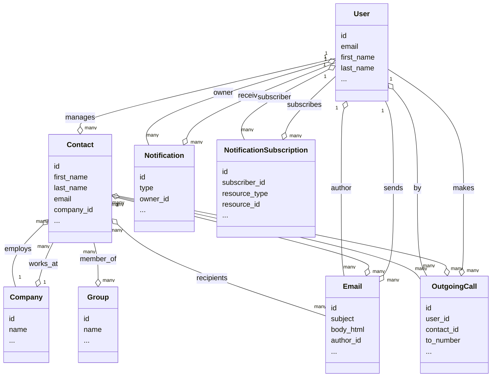
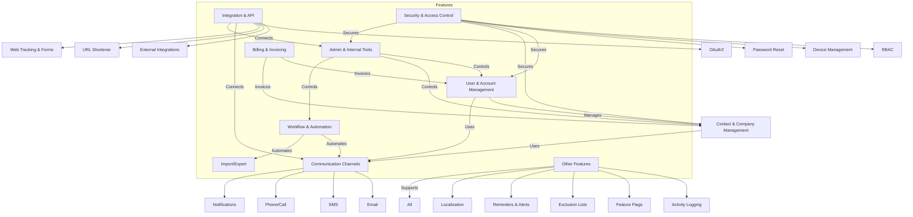

---
tags:
  - comvex-onboarding
---
# Models

## Models relation

- User manages Contact, sends Email, makes OutgoingCall, receives Notification, and subscribes to NotificationSubscription.

- Contact works at Company, receives Email, is called via OutgoingCall, and can be a member of Group.

- Company employs Contact.

- Email is authored by User and sent to Contact.

- OutgoingCall is made by User to Contact.

- Notification and NotificationSubscription are linked to User.

# Homepage
My Account / Account dashboard: 
- What is the difference?

We have contact/user ??? what is differences?

Contact có thể tạo? như mà properties đâu ??? real estate need an apartment right.

**IP Restriction** ? how?? and what restricted??

Why upload has to have UID?

Usser submit form then they become a lead then we convert them to contact(customer)
Create form will have the api key for this
fter create a Form, digima return the form authcode, then they using rest to call to digima to create lead.

Contact form 7
Emails to leads
- > create email add, user using email add to set as form.
- sendgrid receive email, then sendgrid send to digima as a weebhook
Portal: search house -> s connect with digima, then when customer connect to summo, digima will receive this.

## UIPAth
RPA (Robotic Process Automation) tools are software solutions that automate repetitive, rule-based tasks typically performed by humans in business processes . replace by `browser-worker`  to craw info mation.
Login and grab information from summoo

## webtracking
webtracking using for steel cookie of user then tracking them name and email only.

# Bug:
- Error when click drop down when upload file fails
- Back from upload field don't work correctly (it always back to the import page)
* layout broken when Page have headline: https://app.digima.local:8080/settings/profile/inbox/connected
* Connect imbox really using credentials.
* https://app.digima.local:8080/import/9/successes: Show 17 successes ??? should be Inprogress.

Local: in my machine
STG: Corellion, link with bookmark 

Boosted == started
Customer subscribe

**I can assigned to any one?**

# Features
- Contact
	- Create single contact
	- Import list contacts
	- Update contact fields
	- Export contact **But why export in zip files**
	- Auto update contact to "Approached" when set activities
	- Set meeting with contact
- Contact group:
	- list of contact, can be dynamic or static
	- 
- Company:
	- auto sync contact have email match with company 
	- Import/export company

* Activites:
	* Base on both members and company: created day, sms send, ...

* Campaign:

* Mail:
	* Send single receive mails
	* Send bulk emails
	* Schedule
* Web tracking: ??? using script attach to user web
* Workflows: 
	* Instead of create campaign and manually approach contacts, we have workflows
	* Only can set sms, email in flow
	* 
* 
* File: all attended email 

* Connect with anpadL
	* after change will sync to andpad-order vise versa
	* Like ready to build house this data will send to andpad for create ordder.

# Data

1. Saas so each data will save in to  dgm_account_\<\<clientID\>\>
2. Invoice system didn't have

