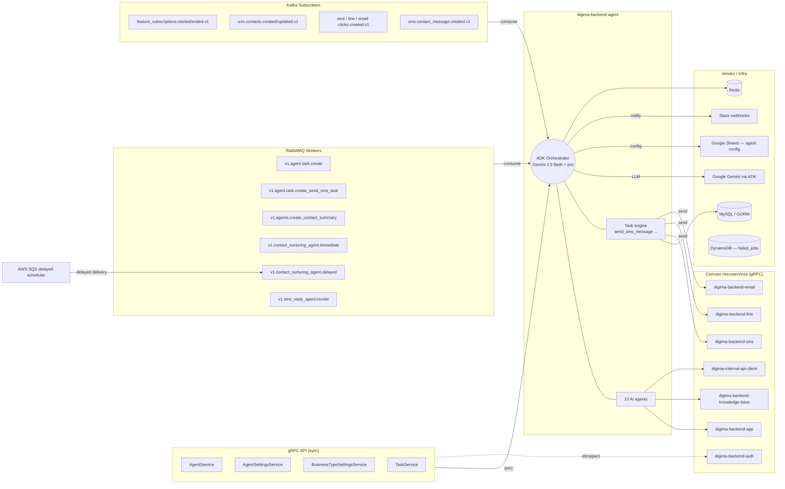
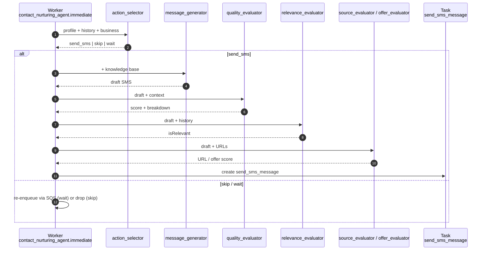
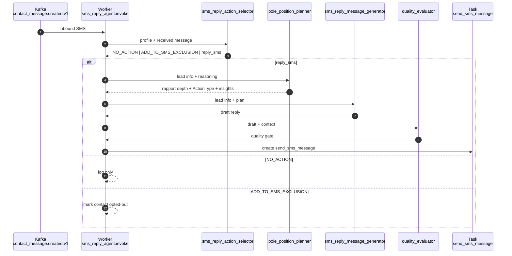

# digima-backend-agent — AI Agent Detail

Go microservice that hosts 10 Gemini-based agents (via Google ADK) and orchestrates them into two business pipelines: **Contact Nurturing** (proactive outbound SMS) and **SMS Reply** (inbound SMS reply). It is invoked through gRPC, RabbitMQ workers, Kafka event subscribers, and AWS SQS delayed scheduling.

---

## 1. Trigger & Integration Map

---

## 2. Triggers in detail

All wiring lives in `app/providers/routes.go`.

### 2.1 gRPC services (`routes.go:60-98`)

| Service | Purpose |
|---|---|
| `AgentService` | CRUD on agent registrations for a tenant |
| `AgentSettingsService` | Per-agent feature flags & configuration |
| `BusinessTypeSettingsService` | Business-type rules (real estate, recruiting, etc.) |
| `TaskService` | Create / inspect agent tasks (e.g. `send_sms_message`) |

Interceptor chain: `log → recovery → authIntrospect → (xray) → db`. Auth is delegated to `digima-backend-auth`.

### 2.2 RabbitMQ workers (`routes.go:181-220`)

| Queue | Trigger | Pipeline |
|---|---|---|
| `v1.agent.task.create` | New agent task created | Task engine |
| `v1.agent.task.create_send_sms_task` | Convert nurture decision into a `send_sms_message` task | Task engine |
| `v1.agents.create_contact_summary` | Generate timeline summary for a contact | `activities_summary_agent` |
| `v1.contact_nurturing_agent.immediate` | Run contact nurturing now | Contact Nurturing pipeline |
| `v1.contact_nurturing_agent.delayed` | Re-enqueued by SQS after delay | Contact Nurturing pipeline |
| `v1.sms_reply_agent.invoke` | Handle inbound SMS reply | SMS Reply pipeline |

Three RabbitMQ processor pools: `default_bulk`, `contact_nurturing`, `sms_reply` — each `ProcessCount=2 / PrefetchCount=1`.

### 2.3 Kafka subscribers (`routes.go:134-156`)

| Topic | Effect |
|---|---|
| `tenant.backend_app.feature_subscriptions.started.v1` | Enable agents for tenant |
| `tenant.backend_app.feature_subscriptions.ended.v1` | Disable agents for tenant |
| `crm.backend_app.contacts.created.v1` | Seed nurturing eligibility |
| `crm.backend_app.contacts.updated.v1` | Refresh contact profile |
| `sms.sms_api.clicks.created.v1` | Signal interest → may enqueue nurture |
| `line.line_api.clicks.created.v1` | Same, LINE channel |
| `email.email_api.clicks.created.v1` | Same, email channel |
| `email.backend_app.clicks.created.v1` | Same, classic email |
| `sms.sms_api.contact_message.created.v1` | Inbound SMS → enqueue `sms_reply_agent.invoke` |

Middleware: `log → recovery → auth → db → accountAllowed` (the last check rejects events for tenants without an active agent subscription).

### 2.4 AWS SQS — delayed scheduler

Used by the contact nurturing pipeline to implement "wait N hours/days, then re-evaluate". Re-enqueues the job back into `v1.contact_nurturing_agent.delayed`. Survives process restarts.

---

## 3. AI Agent Catalogue

All agents live in `infra/agent/<name>/`. Each has an `agent.go` (or `<name>_agent.go`) defining the ADK agent and a `instructions.go` carrying the LLM system prompt.

### 3.1 At-a-glance

| # | Agent | Model | Tools | Pipeline |
|---|---|---|---|---|
| 1 | `activities_summary_agent` | gemini-2.5-flash | — | standalone (worker `create_contact_summary`) |
| 2 | `contact_nurturing_action_selector` | gemini-2.5-flash | — | Contact Nurturing — step 1 |
| 3 | `message_generator` | gemini-2.5-flash | `query_knowledge_base` | Contact Nurturing — step 2 |
| 4 | `generated_message_quality_evaluator` | gemini-2.5-flash | `query_knowledge_base`, Google Search | both — step 3 quality gate |
| 5 | `message_relevance_evaluator` | gemini-2.5-flash | — | Contact Nurturing — step 4 |
| 6 | `offer_evaluator` | gemini-2.5-flash | `query_knowledge_base`, Google Search | both — fact-check |
| 7 | `source_evaluator` | gemini-2.5-flash | — | both — URL freshness |
| 8 | `sms_reply_action_selector` | gemini-2.5-flash | — | SMS Reply — step 1 |
| 9 | `sms_reply_pole_position_planner` | gemini-2.5-pro | `query_knowledge_base` | SMS Reply — step 2 |
| 10 | `sms_reply_message_generator` | gemini-2.5-pro | — | SMS Reply — step 3 |

> **Why two flash and two pro?** Strategy + final reply generation use `gemini-2.5-pro` for stronger reasoning; routing, summarization and evaluation use `gemini-2.5-flash` for cost.

### 3.2 Per-agent reference

#### 1. `activities_summary_agent`
- **What it does** — Turns a customer's mixed activity timeline (page views, meetings, calls, downloads) into a single Japanese narrative for the rep.
- **Input** — `ActivitiesSummaryAgentRequest{ Activities []Activity }` where each activity has `occurred_at / type / initiated_by / details`.
- **Output** — `{ Summary string }`.
- **Caller** — `domain/adapters/agent` invoked by the `v1.agents.create_contact_summary` worker.
- **Hard rule** — "Write the summary as a timeline-based narrative rather than disconnected bullet points." Prioritises high-value interactions (meetings, consultations) over low-value logs (page views).

#### 2. `contact_nurturing_action_selector`
- **What it does** — Decides the next outreach action for a contact: `send_sms`, `skip`, or `wait`.
- **Input** — Contact ID, profile JSON, message history, contact statuses, business type, company strength.
- **Output** — `{ Action, Reasoning }`.
- **Caller** — `domain/services/contact_nurturing/service.go SelectAction()`.
- **Hard rule** — "Avoid excessive contact while respecting rejection signals." Reasoning is mandatory.

#### 3. `message_generator`
- **What it does** — Drafts a nurture SMS message grounded in the knowledge base and the company's strength deck.
- **Input** — Contact profile, message history, selected action, business type, company strength, last sent messages, contact statuses.
- **Output** — `{ Message }` (SMS body, ≤ 660 chars).
- **Caller** — `domain/services/contact_nurturing/service.go GenerateMessage()`.
- **Hard rule** — "Root claims in knowledge base; do not invent specific dates, event names, or sales narratives." Pole-position writing: 7:3 known:unknown ratio.

#### 4. `generated_message_quality_evaluator`
- **What it does** — Scores a drafted message 0–100 against tone, guardrails, strategy compliance, accuracy.
- **Input** — Drafted message, message history, contact profile JSON.
- **Output** — `{ Score, Feedback, FeedbackBreakdown }` with 7 sub-scores: generation_relevance, accuracy, phase_appropriateness, pole_position_offer, guardrails, tone, revision_proposal.
- **Caller** — `domain/services/contact_nurturing/pipeline.go evaluateMessage()` and the SMS Reply pipeline.
- **Hard rule** — Guardrails block tracking language ("ご関心をお寄せいただき"), age/salary/family-name leaks, and budget references unless the customer raised them.

#### 5. `message_relevance_evaluator`
- **What it does** — Catches drafts that repeat past content, ignore prior answers, or target rejected contacts.
- **Input** — Drafted message + message history.
- **Output** — `{ IsRelevant bool, Reason, Advice }`.
- **Caller** — Contact Nurturing pipeline (after message_generator).
- **Hard rule** — "Return false if repeating ignored message or asking already-answered questions."

#### 6. `offer_evaluator`
- **What it does** — Fact-checks event/offer claims (dates, locations, facility names) against the knowledge base and a Google Search subagent.
- **Input** — Message, knowledge_retrieved JSON, current_datetime RFC3339.
- **Output** — `{ Score (0–100), Feedback }`.
- **Caller** — Domain via adapter.
- **Hard rule** — Score 0 if an event date is in the past; don't present outdated events or incorrect addresses.

#### 7. `source_evaluator`
- **What it does** — Validates URL freshness and that linked content matches the message's claims.
- **Input** — Message, knowledge_retrieved, current_datetime.
- **Output** — `{ Score, Feedback }`.
- **Caller** — Domain via adapter.
- **Hard rule** — Time-based validity is critical; past-dated events ⇒ score 0. Do not invent locations not present in source content.

#### 8. `sms_reply_action_selector`
- **What it does** — Routes an inbound SMS: `NO_ACTION` / `ADD_TO_SMS_EXCLUSION` / `reply_sms`, plus a recommended contact status.
- **Input** — Contact ID, profile, message history, relevant messages, received message, contact statuses.
- **Output** — `{ Action, Reasoning(context, analysis, strategy), RecommendedStatus }`.
- **Caller** — `domain/services/sms_reply/service.go SelectAction()`.
- **Hard rule** — Distinguish *true rejection* ("never contact again") from *reflexive pushback* ("busy now"). iMessage tapback reactions → `NO_ACTION`. Assume good intent unless explicit refusal.

#### 9. `sms_reply_pole_position_planner`
- **What it does** — Rates rapport depth 1–6 and chooses posture: `BUILD_RAPPORT` or `OFFER`. Pulls supporting insights from the knowledge base.
- **Input** — Lead info, action-selector reasoning, business type, contact statuses.
- **Output** — `{ RapportDepth, ActionType, PlanDetails, Insights, InsightsEvaluation, Requests, OfferInfo, SearchedQueries, SearchResults[], SourceUrlResults[] }`.
- **Caller** — `domain/services/sms_reply/pipeline.go:45 planStrategy()`.
- **Hard rule** — Level ≤ 4 ⇒ must `BUILD_RAPPORT`. Only level ≥ 5 (≥ 2 positive exchanges + clear value understanding) unlocks `OFFER`. Max 3 KB searches; halt if results empty.

#### 10. `sms_reply_message_generator`
- **What it does** — Writes the final SMS reply using the pole-position plan.
- **Input** — Lead info, company business info, action reasoning, full pole-position plan (rapport depth, action type, insights, requests, offer info).
- **Output** — `{ Message, PromptVersion, LlmModel, SessionId }`. Message is 100–300 chars excluding any URL.
- **Caller** — `domain/services/sms_reply/service.go GenerateMessage()`.
- **Hard rule** — Never mention budget, family members, or tracking language. Use `[CONTACT_NAME_PLACEHOLDER]` instead of real names. Enforce 7:3 law (7 known mirrors : 3 pro insight). `BUILD_RAPPORT` if rapport depth ≤ 4; only `OFFER` at ≥ 5.

---

## 4. Pipelines

### 4.1 Contact Nurturing pipeline

`domain/services/contact_nurturing/service.go` → `pipeline.go`.

If any evaluator fails or scores too low, the worker re-enqueues with backoff via SQS into `v1.contact_nurturing_agent.delayed`.

### 4.2 SMS Reply pipeline

`domain/services/sms_reply/service.go` → `pipeline.go:45`.

---

## 5. External dependencies

### 5.1 Comvex microservices (gRPC clients)

| Service | Used for |
|---|---|
| `digima-backend-app` | Tenant + feature subscription state |
| `digima-backend-auth` | Token introspection (every gRPC call) |
| `digima-backend-sms` | Actually sends SMS produced by `send_sms_message` |
| `digima-backend-line` | LINE message delivery |
| `digima-backend-email` | Email delivery |
| `digima-backend-knowledge-base` | Customer KB + company strength data; backs the `query_knowledge_base` tool |
| `digima-internal-api-client` | Misc internal queries |

### 5.2 Vendor / infra

| Dep | Used for |
|---|---|
| Google Gemini (via ADK) | All LLM calls. Models: `gemini-2.5-flash` (default), `gemini-2.5-pro` (planner + reply generator). |
| Google Sheets | Runtime config for contact-nurturing and sms-reply prompt knobs |
| Slack webhooks | Quality alerts + task notifications |
| MySQL (GORM) | Agent state, tasks, ADK session persistence |
| Redis | Session / cache |
| DynamoDB | `failed_jobs` table for worker retries |
| AWS SQS | Delayed scheduling of nurturing re-evaluation |
| AWS X-Ray | Tracing (opt-in via `IsTracingEnabled`) |

---

## 6. Session & token bookkeeping

- ADK sessions are managed in `infra/agent/session_manager.go` and persisted in MySQL.
- Session key format: `AppName + UserID` where `UserID = "A{AccountId}C{ContactId}"`.
- Agents **do not share sessions across agents** — each agent in a pipeline opens its own session for the same contact.
- Every agent call has up to **3 retries** on malformed JSON (`agentInfra.AppendTokenUsage`).
- Token usage (`ModelName`, `Provider=Google`, prompt + completion tokens) is logged into ADK session events and surfaced via `infra/agent/token_usage.go`.

---

## 7. Quick reference — where to look

| You want… | Open |
|---|---|
| Add / remove a trigger | `app/providers/routes.go` |
| Change an agent's prompt | `infra/agent/<agent>/instructions.go` |
| Change an agent's model / tools | `infra/agent/<agent>/agent.go` |
| Add a new agent to a pipeline | `domain/services/contact_nurturing/pipeline.go` or `domain/services/sms_reply/pipeline.go` |
| Wire a new gRPC method | `interface/resources/<domain>/grpc/v1/` + `routes.go:registerGrpcRoutes` |
| Add a Kafka event handler | `interface/resources/<domain>/event/` + `routes.go:registerEventListenerRoutes` |
| Add a RabbitMQ worker | `interface/resources/<domain>/worker/` + `routes.go:registerWorkerRoutes` |
| Inspect a stuck job | DynamoDB `failed_jobs` table |
| Inspect agent sessions | `infra/agent/session_manager.go` + MySQL `sessions` table |

---

## 8. Related notes

- Domain context — see the `domain/` folder in this vault: `sms`, `crm`, `tenant`, `workflow`, `auth`, `email`.
- Sister services — see `projects/` in this vault: `backend-app`, `digima-backend-email`, `sms`, `auth`, `scheduler`, `framework`.

