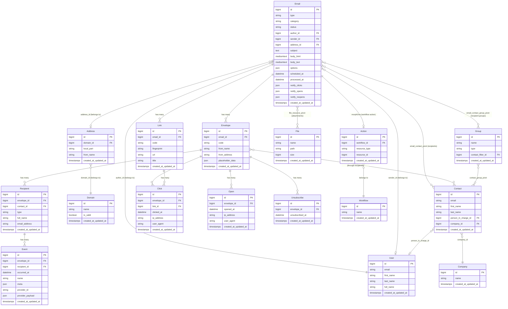

# entities

```mermaid
erDiagram

%% Core Email Entities

Email ||--o{ Envelope : "has many"

Envelope ||--o{ Recipient : "has many"

Recipient ||--o{ Event : "has many"

%% Email Configuration

Email }o--|| User : "author_id (belongs to)"

Email }o--o| User : "sender_id (belongs to)"

Email }o--o| Address : "address_id (belongs to)"

Address }o--|| Domain : "domain_id (belongs to)"

%% Email Recipients (Many-to-Many)

Email }o--o{ Contact : "email_contact_pivot (recipients)"

Email }o--o{ Group : "email_contact_group_pivot (recipient groups)"

%% Envelope Relationships

Envelope }o--o{ Contact : "email_envelope_recipients (through recipients)"

%% Tracking Entities

Email ||--o{ Link : "has many"

Envelope ||--o{ Click : "has many"

Envelope ||--o{ Open : "has many"

Envelope ||--o{ Unsubscribe : "has many"

Link ||--o{ Click : "has many"

%% File Attachments (Polymorphic)

Email }o--o{ File : "file_resource_pivot (attachments)"

%% Workflow Integration (Polymorphic)

Email ||--o| Action : "morphOne (workflow action)"

Action }o--|| Workflow : "belongs to"

%% Contact Relationships

Contact }o--o| User : "person_in_charge_id"

Contact }o--|| Company : "company_id"

Group }o--o{ Contact : "contact_group_pivot"

%% Entity Definitions

Email {

bigint id PK

string type

string category

string status

bigint author_id FK

bigint sender_id FK

bigint address_id FK

text subject

mediumtext body_html

mediumtext body_text

json options

datetime scheduled_at

datetime processed_at

json notify_clicks

json notify_opens

json notify_reopens

timestamps created_at_updated_at

}

Envelope {

bigint id PK

bigint email_id FK

string code

string from_name

string from_address

json placeholder_data

timestamps created_at_updated_at

}

Recipient {

bigint id PK

bigint envelope_id FK

bigint contact_id FK

string type

string full_name

string email_address

timestamps created_at_updated_at

}

Event {

bigint id PK

bigint envelope_id FK

bigint recipient_id FK

datetime occurred_at

string name

json meta

string provider_id

json provider_payload

timestamps created_at_updated_at

}

Address {

bigint id PK

bigint domain_id FK

string local_part

string from_name

timestamps created_at_updated_at

}

Domain {

bigint id PK

string name

boolean is_valid

timestamps created_at_updated_at

}

Link {

bigint id PK

bigint email_id FK

string code

string fingerprint

string url

string title

timestamps created_at_updated_at

}

Click {

bigint id PK

bigint envelope_id FK

bigint link_id FK

datetime clicked_at

string ip_address

string user_agent

timestamps created_at_updated_at

}

Open {

bigint id PK

bigint envelope_id FK

datetime opened_at

string ip_address

string user_agent

timestamps created_at_updated_at

}

Unsubscribe {

bigint id PK

bigint envelope_id FK

datetime unsubscribed_at

timestamps created_at_updated_at

}

Contact {

bigint id PK

string email

string first_name

string last_name

bigint person_in_charge_id FK

bigint company_id FK

timestamps created_at_updated_at

}

Group {

bigint id PK

string name

string type

bigint contact_filter_id FK

timestamps created_at_updated_at

}

User {

bigint id PK

string email

string first_name

string last_name

string full_name

timestamps created_at_updated_at

}

Action {

bigint id PK

bigint workflow_id FK

string resource_type

bigint resource_id

timestamps created_at_updated_at

}

Company {

bigint id PK

string name

timestamps created_at_updated_at

}

File {

bigint id PK

string name

string path

bigint size

timestamps created_at_updated_at

}

Workflow {

bigint id PK

string name

timestamps created_at_updated_at

}
```
