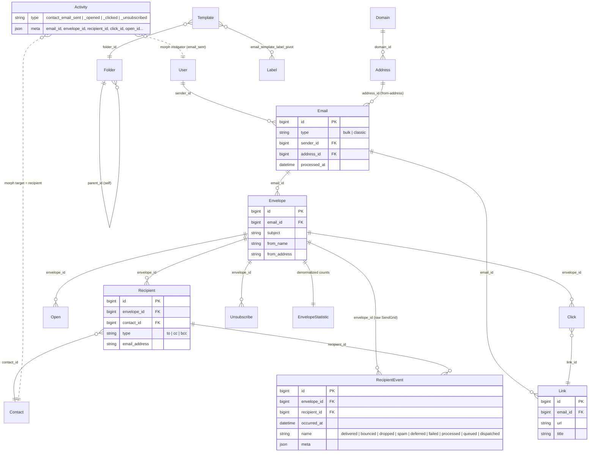

# Email Relationship Diagram

This note documents the **legacy / SendGrid** email domain in `digima-backend-app` — the `Email`, `Envelope`, `Recipient`, etc. models that power Bulk and Classic outbound sends. It does **not** cover the inbox email microservice (Gmail/Outlook IMAP/Graph) — see [[Contact Email]] for the legacy-vs-inbox distinction.

Companion files:
- Parent: [[email]] — earlier raw entity dump
- Sibling: [[Contact Email]] — legacy vs inbox split

## TL;DR

```
Email (one composed message)
  └── Envelope (one delivery batch — bulk = many; classic = one)
        ├── Recipient (per-contact fan-out: TO/CC/BCC) ──► Contact
        │     └── RecipientEvent (raw SendGrid event log)
        ├── Open
        ├── Click ──► Link
        ├── Unsubscribe
        └── EnvelopeStatistic (denormalized counts)
```

`Email` also owns:
- `Link` (trackable URLs in body)
- `Sender` (User who composed)
- `Address` (from-address, scoped by `Domain`)
- `Template` / `Folder` / `Label` (when composed from a template)

`Activity` (timeline rows of type `contact_email_*`) is a denormalized projection of these events — not a parent.

## Full ER diagram



## Entity reference

| Model | Table | Purpose |
|---|---|---|
| `Email` | `emails` | The composed message. `type` = `bulk` or `classic`. Owns body, subject template, links, attachments. |
| `Envelope` | `email_envelopes` | One **delivery batch** for an email. Bulk emails fan out into many envelopes (one per recipient batch); classic emails have one. Carries the rendered subject, from_name, from_address. |
| `Recipient` | `email_envelope_recipients` | Per-contact fan-out inside an envelope, with `type` = `to`/`cc`/`bcc`. Joins to `Contact`. |
| `RecipientEvent` | `email_envelope_recipient_events` | **Raw SendGrid event log**: `delivered`, `bounced`, `dropped`, `spam`, `deferred`, `failed`, `processed`, `queued`, `dispatched`. Per-recipient. |
| `Open` | `email_envelope_opens` | Pixel-tracked open. **Hangs off `Envelope`, not `Recipient`** — SendGrid open webhooks don't always identify the recipient. |
| `Click` | `email_envelope_clicks` | Tracked link click. References both `Envelope` and `Link`. |
| `Unsubscribe` | `email_envelope_unsubscribes` | Unsubscribe via tracked link. |
| `Link` | `email_links` | Trackable URLs extracted from the email body. Owned by `Email` (not `Envelope`) — the same link instance is shared across all envelopes of a bulk send. |
| `Address` | `email_addresses` | A from-address. Belongs to a `Domain`. |
| `Domain` | `email_domains` | Sender domain. Has `is_valid` flag — invalid domains decrement account credits in `DispatchEnvelopeJob`. |
| `EnvelopeStatistic` | `envelope_statistics` | Denormalized counts (opens, clicks, etc.) maintained by `Listeners/Email/Envelope/UpdateStatisticSubscriber`. One row per envelope. |
| `Template` / `Folder` / `Label` | `email_templates` / `email_template_folders` / `email_template_labels` | Reusable composition. Folders form a self-referential tree. Labels are many-to-many via `email_template_label_pivot`. |
| `Activity` | `activities` | Timeline projection. **Not a parent of any of the above** — it's a denormalized log written by `LogActivitySubscriber` after the source models are saved. |

## Cardinalities

| Edge | Type | FK | Notes |
|---|---|---|---|
| `User` → `Email` | 1—N | `emails.sender_id` | The user who composed |
| `Address` → `Email` | 1—N | `emails.address_id` | From-address |
| `Domain` → `Address` | 1—N | `email_addresses.domain_id` | Sender domain |
| `Email` → `Envelope` | 1—N | `email_envelopes.email_id` | Bulk = many; Classic = one |
| `Email` → `Link` | 1—N | `email_links.email_id` | Tracked URLs |
| `Email` → `Click`/`Open`/`Unsubscribe` | 1—N **through** `Envelope` | `hasManyThrough` | No direct FK — traverses Envelope |
| `Envelope` → `Recipient` | 1—N | `email_envelope_recipients.envelope_id` | TO/CC/BCC fan-out |
| `Envelope` → `Open` | 1—N | `email_envelope_opens.envelope_id` | |
| `Envelope` → `Click` | 1—N | `email_envelope_clicks.envelope_id` | |
| `Envelope` → `Unsubscribe` | 1—N | `email_envelope_unsubscribes.envelope_id` | |
| `Envelope` → `RecipientEvent` | 1—N | `email_envelope_recipient_events.envelope_id` | Raw SendGrid |
| `Recipient` → `RecipientEvent` | 1—N | `email_envelope_recipient_events.recipient_id` | Per-recipient SendGrid events |
| `Contact` → `Recipient` | 1—N | `email_envelope_recipients.contact_id` | |
| `Click` → `Link` | N—1 | `email_envelope_clicks.link_id` | Which URL was clicked |
| `Activity` ⇢ `Contact` | morph | `target_type/target_id` | For `contact_email_*` types target = Contact |
| `Activity` ⇢ `Click`/`Open`/`Unsubscribe`/`User` | morph | `instigator_type/instigator_id` | Varies by type |

## Data-flow timeline (one bulk send → one open → one click)

1. **Compose**: User saves an `Email` (`type=bulk`), `Link` rows are extracted from the body.
2. **Schedule**: A `CreateEnvelopeJob` materializes one `Envelope` per recipient batch and `Recipient` rows under it.
3. **Dispatch**: `DispatchEnvelopeJob` calls SendGrid for each envelope, then fires `BulkEmailEnvelopeDispatchedEvent`.
4. **Sent activity**: `Listeners/Email/Bulk/LogActivitySubscriber` writes a `contact_email_sent` `Activity` row per recipient.
5. **SendGrid event webhook** (delivered/bounce/dropped/spam/...) → `RecipientEvent` row created. **No corresponding `Activity` row for delivery/bounce/dropped/spam** — these terminal states live only in `RecipientEvent`.
6. **Open**: SendGrid pixel webhook → `OpensController` → `Open` row → `OpenedEvent` → `LogActivitySubscriber` writes `contact_email_opened` `Activity`.
7. **Click**: SendGrid redirect webhook → `ClicksController` → `Click` row (FK to `Link`) → `ClickedEvent` → `LogActivitySubscriber` writes `contact_email_clicked` `Activity` and **also synthesizes a paired open** if none exists yet.
8. **Side effects** (post-Activity write):
    - `Contact.last_action_type` / `last_action_occurred_at` updated
    - `EnvelopeStatistic` counts incremented
    - `ContactAllFieldsIndex` (Elasticsearch via FilterClient gRPC) upserted with `clicked_email_ids`, `opened_email_ids`, `clicked_link_ids`
    - `EngagementScoreCalculator` recomputes contact score

## Quirks worth knowing

- **Open/Click/Unsubscribe hang off Envelope, not Recipient.** Reverse-attributing them to a specific contact requires resolving through `Recipient`.
- **Bounces/dropped/spam are not `Activity` rows.** They live only in `RecipientEvent`. The Slack alert in `feat/notify-bounced-email-recipients` is the only surface for them today.
- **`Email` → click/open/unsubscribe is `hasManyThrough` Envelope** — no direct FK exists.
- **`Link` is owned by `Email`**, not `Envelope`. One link instance is shared across the entire bulk send.
- **`Classic\LogActivitySubscriber` is not queued** (does not implement `ShouldQueue`); the bulk and inbox variants are queued. Likely intentional but worth checking.
- **Unsubscribe activity logs only the envelope's main recipient.** Open and click loop over all recipients.
- **`activities.meta`** denormalizes `email_id`, `envelope_id`, `recipient_id`, plus event-specific keys (`click_id`, `link_url`, `open_id`, `unsubscribe_id`). There is no FK from `activities` to `emails` — reverse lookups go through JSON.

## Inbox emails (out of scope here)

The `contact_email_inbox_*` activity types reference a separate model namespace under `app/Models/Account/Lead/Inbox/{Inbox,Message}.php` — that's the IMAP/Graph-synced inbox handled by the email microservice, not the SendGrid pipeline above. The two systems share `Activity` as a unified timeline but **do not share envelope/recipient tables**.

See [[Contact Email]] for a side-by-side comparison.

## Source references

Models:
- `app/Models/Account/Email/Email.php`
- `app/Models/Account/Email/Envelope/Envelope.php`
- `app/Models/Account/Email/Envelope/Recipient/{Recipient,Event}.php`
- `app/Models/Account/Email/Envelope/{Open,Click,Unsubscribe,Statistic}.php`
- `app/Models/Account/Email/{Link,Address,Domain}.php`
- `app/Models/Account/Email/Template/{Template,Folder,Label}.php`

Listeners (event → activity):
- `app/Listeners/Email/{Bulk,Classic}/LogActivitySubscriber.php`
- `app/Listeners/Email/LogActivitySubscriber.php` (open/click/unsubscribe)
- `app/Listeners/Email/Envelope/UpdateStatisticSubscriber.php`
- `app/Listeners/Filter/UpdateFilterIndexesSubscriber.php` (search index)

Jobs:
- `app/Jobs/Email/Envelope/DispatchEnvelopeJob.php`
- `app/Jobs/Email/Envelope/{Click,Open,Unsubscribe}/Create*Job.php`
- `app/Jobs/Activity/{CreateActivityJob,CreateActivitiesJob}.php`

Services:
- `app/Services/ActivityLogger.php`
- `app/Services/Activities/{ActivityHelper,MetaEnricher}.php`
- `app/Services/Contact/EngagementScoreCalculator.php`

Migrations (key):
- `database/migrations/account/mysql/2018_01_01_0003{80,90,95}_*` — envelopes, recipients, recipient_events
- `database/migrations/account/mysql/2018_01_01_0004{00,10,20}_*` — opens, clicks, unsubscribes
- `database/migrations/account/mysql/2018_01_01_000270_account_create_activities_table.php` — activities
- `database/migrations/account/mysql/2020_05_27_114100_account_alter_contacts_table.php` — `last_action_type` / `last_action_occurred_at`
