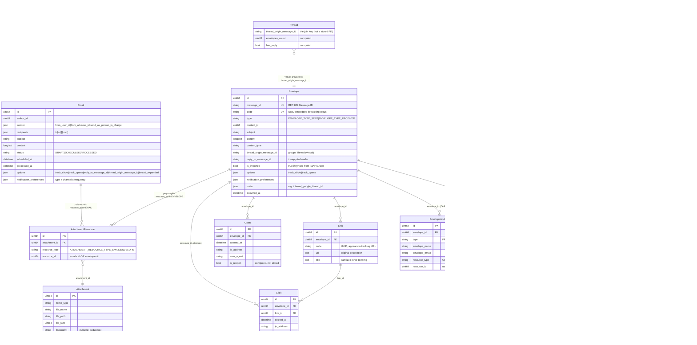

# Inbox Email Relationship Diagram

This note documents the **inbox email** domain that powers per-user IMAP/SMTP and OAuth2 (Gmail / Microsoft Graph) sending and syncing. It lives in two Go repos:

- **`digima-backend-email-api`** — owns the MySQL schema and all GORM models. Synchronous gRPC/REST surface.
- **`digima-backend-email-worker`** — has no DB models of its own. Consumes queue jobs, talks to the user's mailserver, and calls back into the api to persist results.

For the legacy SendGrid bulk/classic pipeline, see the sibling [[../email/Relationship Diagram|Email Relationship Diagram]]. The two systems do **not** share envelope, recipient, link, click, or open tables.

Companion files:
- Sibling: [[../email/Relationship Diagram|Legacy SendGrid Email Relationship Diagram]]
- Parent: [[../Domains|Domains index]]

## TL;DR

```
Email (composed draft, lives only in email-api)
  │   status: DRAFT → SCHEDULED → PROCESSED
  │   attachments via attachment_resources (polymorphic)
  │
  └── (no FK!) ──► Envelope(s) materialised by EnvelopeService.CreateFromEmail
                   │   type: SENT | RECEIVED
                   │   message_id (RFC 822) UQ, code (UUID for tracking) UQ
                   │
                   ├── EnvelopeUser  (M..N: which Digima users see it)
                   ├── EnvelopeAddress (FROM/TO/CC/BCC × USER|CONTACT)
                   ├── Link ──► Click   (rewritten <a href> in body)
                   ├── Open             (1×1 tracking pixel hits)
                   ├── attachment_resources ──► Attachment (polymorphic)
                   └── thread_origin_message_id ──► virtual Thread

Connection (per user, per mailbox)
  ├── ProviderDetail / Provider (server config)
  └── Authorization (OAuth2 grants)
```

## Full ER diagram



## Entity reference

| Model | Table | Purpose |
|---|---|---|
| `Email` | `emails` | The composed message authored by a Digima user. Status lifecycle `DRAFT → SCHEDULED → PROCESSED`. Holds `sender` (json), `recipients` (json `to`/`cc[]`/`bcc[]`), `options` (track_clicks/track_opens/reply_to/thread_origin), and `notification_preferences`. |
| `Envelope` | `envelopes` | One actually-transmitted message. `type` is `SENT` (originated by the user) or `RECEIVED` (synced from IMAP/Graph). `code` is a UUID that gets embedded in tracking URLs and the open pixel. `message_id` is the RFC 822 header (UQ) and `thread_origin_message_id` groups the Thread. |
| `EnvelopeUser` | `envelope_users` | M..N owners of the envelope. Drives "which users see this in their inbox view". CASCADE on envelope delete. |
| `EnvelopeAddress` | `envelope_addresses` | One row per FROM/TO/CC/BCC participant. `resource_type/resource_id` resolve to `users` or `contacts` in another service (nullable when external email has no internal mapping). |
| `Link` | `links` | A trackable URL extracted from envelope content at send time. `code` is a UUID embedded in the rewritten anchor. **Owned by `Envelope` (1..N), not `Email`** — unlike legacy SendGrid. |
| `Click` | `clicks` | One row per tracked-URL hit. FK to both `Link` and `Envelope` (envelope_id is denormalized for fast per-envelope lookups). |
| `Open` | `opens` | One row per tracking-pixel render. `is_reopen` is computed at read time, not stored. |
| `Attachment` | `attachments` | The actual file (mime_type, file_name, file_path in storage, file_size). `fingerprint` enables dedup; `content_id` stores the RFC 2392 CID for inline images. |
| `AttachmentResource` | `attachment_resources` | Polymorphic join. `(attachment_id, resource_type ∈ {EMAIL, ENVELOPE}, resource_id)` is unique. Lets one file row attach to a draft and to all envelopes spawned from it without copying bytes. |
| `Connection` | `connections` | A user's mail account binding. Holds the `authorization_type` (BASIC SMTP/IMAP, OAUTH2_GOOGLE, OAUTH2_MICROSOFT) and a Vault key for credentials. |
| `Authorization` | `authorizations` | OAuth2 grant state attached to a Connection. |
| `ProviderDetail` / `Provider` | `provider_details` / `providers` | Server config (SMTP/IMAP hosts, ports, folder names) for the chosen provider. Replaces the deprecated `connections.smtp_*` / `imap_*` embedded columns. |
| `Thread` | *(virtual)* | **Not a table.** A Go struct with a GORM `foreignKey:ThreadOriginMessageID` association — aggregates envelopes that share `thread_origin_message_id`. `HasReply`, `HasOpens`, `HasClicks`, `EnvelopesCount` are computed. |

## Cardinalities

| Edge | Type | FK / Mechanism | Notes |
|---|---|---|---|
| `Email` → `Envelope` | 1—N | **No FK!** Linked only via `EnvelopeService.CreateFromEmail` reacting to `email.UpdatedEvent` | A draft Email becomes one or more Envelopes when sent; the Email row stays as the draft record |
| `Envelope` → `EnvelopeUser` | 1—N | `envelope_users.envelope_id` (CASCADE) | M..N user↔envelope view ownership |
| `Envelope` → `EnvelopeAddress` | 1—N | `envelope_addresses.envelope_id` (CASCADE) | FROM/TO/CC/BCC fan-out, polymorphic to user|contact |
| `Envelope` → `Link` | 1—N | `links.envelope_id` | Tracked URLs created at send time |
| `Link` → `Click` | 1—N | `clicks.link_id` | Which URL was clicked |
| `Envelope` → `Click` | 1—N | `clicks.envelope_id` | Denormalized for per-envelope lookup |
| `Envelope` → `Open` | 1—N | `opens.envelope_id` | One per pixel render |
| `Email` ↔ `Attachment` | M—N | `attachment_resources(resource_type=EMAIL, resource_id, attachment_id)` polymorphic | One file can sit on a draft and the envelopes spawned from it |
| `Envelope` ↔ `Attachment` | M—N | `attachment_resources(resource_type=ENVELOPE, resource_id, attachment_id)` polymorphic | Same join table, different `resource_type` |
| `Envelope` → `Envelope` (thread) | logical | Shared `thread_origin_message_id`; optional `reply_to_message_id` | `Thread` is a Go struct, not a table |
| `Connection` → `Authorization` | 1—N | `authorizations.connection_id` | OAuth2 grants |
| `Connection` → `ProviderDetail` | 1—1 | `provider_details.connection_id` | Replaces deprecated embedded SMTP/IMAP cols |
| `ProviderDetail` → `Provider` | N—1 | `provider_details.provider_id` | Catalog of providers |
| `Connection` → `Envelope` | logical | Resolved at send/sync time via `connection_id` in worker job; no DB FK | Worker uses Connection to pick SMTP/IMAP/OAuth2 transport |

## Data-flow timeline

### Outbound: composed Email → delivered Envelope

1. **Compose** (api): User creates an `Email` row via gRPC. Status = `DRAFT` or `SCHEDULED` (with `scheduled_at`).
2. **Trigger send** (api): On schedule (`Service.ProcessScheduled`) or immediate send, `email.MarkAsSending()` flips status to `PROCESSED`, then `dispatcher.Fire(email.UpdatedEvent)`.
3. **Materialize Envelope** (api `CreateEnvelopeListener` → `EnvelopeService.CreateFromEmail`):
   - Allocates `message_id` (`makeMessageId`), `code` (UUID), `thread_origin_message_id`.
   - Creates `EnvelopeAddress` rows for sender + each recipient (resolving `users` / `contacts`).
   - Creates `EnvelopeUser` rows for owner visibility.
   - Copies `AttachmentResource` polymorphically from EMAIL → ENVELOPE.
   - Fires `envelope.CreatedEvent`.
4. **Send & track-rewrite** (api `SendEnvelopeListener` → `EnvelopeService.Send`):
   - If `options.track_clicks`: `getTrackableContent` rewrites every `<a href>` to a beacon URL keyed by `envelope.code` + `link.code` and builds a `[]Link` slice (in-memory only at this point).
   - If `options.track_opens`: appends 1×1 tracking pixel `` (`makeTrackingPixel`).
   - Resolves the sending `Connection` via `getFromAddressConnectionId`.
   - Enqueues `EnvelopeSend` job to the worker with the rewritten content.
   - Enqueues `LinksCreateMany` job carrying the in-memory links plus `envelope.id`.
5. **Worker dispatch** (`worker.EnvelopeService.Send`):
   - Resolves credentials from Vault (BASIC) or a fresh OAuth2 token (`resolveOauth2Token`).
   - Sends via SMTP (`sendWithSmtp`) or OAuth2 (`sendWithOauth2` → `resolveGoogleSending` / `resolveMicrosoftSending`).
   - For SMTP: optionally `createSentCopy` APPENDs the message to the user's IMAP "Sent" folder.
   - Fallback path `sendWithFallbackSender` if the user's connection is unusable.
6. **Persist Links** (`worker.LinkService.CreateMany`): worker calls back to the api's Links endpoint, which inserts the `links` rows now bound to the real `envelope_id`.

### Inbound: external mail → synced Envelope

1. **Sync trigger** (worker, scheduled): For each active `Connection`, the worker enqueues one of:
   - `envelope_received_sync_by_next_uid` / `_by_uid` (IMAP, BASIC auth)
   - `envelope_sync_oauth2_received_by_next_ids` (Gmail / Microsoft Graph)
   - mirror jobs for sent folder (`_sent_sync_*`)
2. **Fetch** (worker): pulls UID/ID list from the provider, fetches each message header + body via `adapters` (IMAP / Google API / Graph API).
3. **Validate & normalize** (worker `validateAndCreateReceivedEnvelope`): resolves the contact/user mapping, builds an `Envelope` DTO with `is_imported=true`, fills `meta` (e.g. `internal_google_thread_id`).
4. **Persist** (api): worker calls api to create the `Envelope` row + `EnvelopeAddress` + `EnvelopeUser` + attachment resources. `IsImported=true` short-circuits the SendEnvelope path (so we never re-deliver imported mail).

### Recipient interactions

- **Open**: pixel image GET → api beacon controller → inserts `Open` row → triggers notification check via `Envelope.ShouldNotify(channel)` against `notification_preferences`.
- **Click**: tracked URL GET → api click controller → inserts `Click` row (FK to `Link`) → 302 redirects to `Link.url` → triggers notification check.

## Quirks worth knowing

- **Email → Envelope has no foreign key.** The only thread tying a draft to its delivered envelopes is the in-process `dispatcher.Fire(UpdatedEvent)` chain. SQL has no JOIN path; reverse lookups go through `message_id` / `thread_origin_message_id` or the activity log.
- **`Link` is owned by `Envelope`, not `Email`.** The opposite of legacy SendGrid where one Link is shared across the whole bulk send. Inbox-email creates fresh `Link` rows per envelope.
- **Tracking is rewrite-at-send.** Content rewriting happens once, in `EnvelopeService.Send` (api), right before queuing the worker. The persisted `envelopes.content` is **the rewritten copy**; the original cleartext content is only the `untraceable_content` that the worker uses when appending to the user's IMAP "Sent" folder.
- **Polymorphic attachments use `attachment_resources`, not duck-typed FKs.** The legacy `attachments.envelope_id` column from migration 004 was deprecated in 018/024/025 — do not rely on it.
- **`Thread` is computed.** No `threads` table. `EnvelopesCount`, `HasReply`, `HasOpens`, `HasClicks` are aggregated on read.
- **`Open.is_reopen` is `gorm:"-"`** — derived at read time from prior opens for the same envelope, never persisted.
- **Two `EnvelopeService`s exist.** Same name, opposite responsibilities: api's runs synchronously and rewrites + enqueues; worker's actually does network I/O. Always confirm which repo you are reading.
- **`EnvelopeAddress.resource_type` and `resource_id` are nullable.** External addresses with no internal user/contact mapping still get a row — code paths must null-check before using them.
- **`Connection.smtp_*` / `imap_*` / `sent_folder_name` / `received_folder_name` are deprecated** in favor of `ProviderDetail`. The deprecated columns linger because old rows still populate them.
- **`is_imported=true` envelopes skip the SendEnvelopeListener** (`SendEnvelopeListener.Listen` returns early). This is the gate that prevents re-sending mail we synced in.
- **Notification preferences are 3-D**: `type` (clicks/opens/reopens) × `channel` (email/in_app/mobile) × `frequency` (off/instant/daily/hourly/monthly/weekly). Validation only allows `off|instant`; the others are read but never written by the UI today.
- **`envelopes.unique_code_deleted_at`** is a computed MD5 column ensuring `code` is unique among non-deleted rows but allows reuse after soft-delete. Same trick on `links`.

## Distinction from legacy SendGrid

| | **Legacy `digima-backend-app`** | **Inbox `digima-backend-email-api/-worker`** |
|---|---|---|
| Transport | SendGrid HTTP API | User's own SMTP / IMAP / OAuth2 (Gmail, Microsoft Graph) |
| Use case | Bulk + Classic outbound marketing/transactional | Per-user inbox: send and sync personal mail |
| Repo / language | PHP / Laravel | Go / GORM |
| Service split | Single monolith | Two services (api + worker) communicating via job queue |
| Open/Click source | SendGrid event webhook | Self-hosted beacon endpoints (pixel + redirect) |
| Bulk fan-out | `Envelope` per recipient batch under one `Email` | One `Envelope` per delivery; no bulk concept |
| Link ownership | `Email` → `Link` | `Envelope` → `Link` |
| Attachment join | direct FK | polymorphic `attachment_resources` |
| Thread | none | virtual via `thread_origin_message_id` |
| Activity timeline | `activities` table written by listeners | `Activity` written by the api's `CreateActivitiesListener` after `envelope.CreatedEvent` (different rows than the legacy ones) |

## Source references

### `digima-backend-email-api` (DB-side; all GORM models)

Models:
- `domain/models/email/email.go` — `Email`, `Sender`, `Recipients`, `Options`, `NotificationPreferences`
- `domain/models/email/envelope.go` — `Envelope`, `EnvelopeUser`, `EnvelopeOptions`, `EnvelopeMeta`, regex constants for content rewriting
- `domain/models/email/envelope_address.go` — `EnvelopeAddress` and `EnvelopeAddressType`/`ResourceType` enums
- `domain/models/email/link.go` — `Link`, `NewLink`, `getLinkSanitizedTitle`
- `domain/models/email/click.go` — `Click`, `BeaconClickParameterName`
- `domain/models/email/open.go` — `Open`, `OpenTrackingPixelTag`
- `domain/models/email/attachment.go` — `Attachment`, `AttachmentResource`, polymorphic types
- `domain/models/email/thread.go` — virtual `Thread` aggregator
- `domain/models/email/provider_envelope.go` — `ProviderEnvelope` (DTO from sync)
- `domain/models/connection/{connection,authorization,provider,provider_detail,server_setting}.go`

Services / listeners:
- `domain/services/email/email.go` — draft lifecycle, `ProcessScheduled`, fires `email.UpdatedEvent`
- `domain/services/email/envelope.go` — `Create`, `CreateFromEmail`, `Send` (rewrites + enqueues), `Show`, `Threads`, `DeleteThread`, `getTrackableContent`, `makeTrackingPixel`
- `domain/services/email/{click,open,link,attachment}.go` — beacon handlers
- `interface/listeners/envelope/{create,send}.go` — wires `email.UpdatedEvent` → CreateFromEmail and `envelope.CreatedEvent` → Send
- `interface/listeners/{activity,contact,authorization}/...` — side effects on `envelope.CreatedEvent`
- `app/providers/event.go` — listener registry

Migrations (key):
- `infra/database/migrations/mysql/003_create_envelopes_table.up.sql`
- `infra/database/migrations/mysql/004_create_attachments_table.up.sql`
- `infra/database/migrations/mysql/005_create_envelope_users_table.up.sql`
- `infra/database/migrations/mysql/006_create_clicks_table.up.sql`
- `infra/database/migrations/mysql/007_create_opens_table.up.sql`
- `infra/database/migrations/mysql/008_create_links_table.up.sql`
- `infra/database/migrations/mysql/011_create_emails_table.up.sql`
- `infra/database/migrations/mysql/012_create_attachment_resources_table.up.sql`
- `infra/database/migrations/mysql/014_create_envelope_addresses_table.up.sql`
- `018/024/025_alter_attachments_table.up.sql` — added `fingerprint`, `content_id`, deprecated `envelope_id`

### `digima-backend-email-worker` (transport-side; DTOs only)

Jobs:
- `domain/jobs/envelope_send.go` — `EnvelopeSend` + `EnvelopeSendSlow`
- `domain/jobs/envelope_create.go` — write-back of received envelopes
- `domain/jobs/envelope_received_sync_by_{next_uid,uid}.go` — IMAP receive sync
- `domain/jobs/envelope_sent_sync_by_{next_uid,uid}.go` — IMAP sent sync (mirror)
- `domain/jobs/envelope_sync_oauth2_{by_id,received_by_next_ids,sent_by_next_ids}.go` — Gmail / Graph sync
- `domain/jobs/envelope_replicate_sent_smtp_via_imap.go` — SMTP-sent → IMAP "Sent" copy
- `domain/jobs/email_send_scheduled.go`
- `domain/jobs/link_createmany.go`
- `domain/jobs/connections_*.go`, `attachments_delete.go`

Services:
- `domain/services/envelope.go` — the heavy lifter (~1900 lines): SMTP, OAuth2 Google, OAuth2 Microsoft, sync, validate
- `domain/services/email.go` — `SendScheduled` precondition checks (account enabled, has email subscription)
- `domain/services/link.go` — `CreateMany` callback into api
- `domain/services/connection.go`, `attachment.go`

DTOs (worker's view of api models):
- `domain/dto/envelope.go`
- `domain/dto/link.go`
- `domain/dto/connection.go`
- `domain/dto/attachment.go`
- `domain/dto/provider_detail.go`
