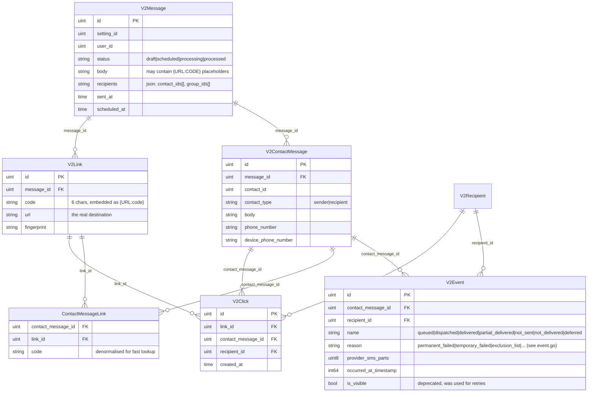

# SMS — Tracking Sent Status and Click Events

This note documents how **`digima-backend-sms-api`** records the *sent status* of an outbound SMS and *clicks* on links embedded in the body. Repo path:
`/Users/dien.vo/Documents/Workspace/Comvex/github.com/comvex-jp/digima-backend-sms-api`.

Companion files:
- Parent: [[../Domains|Domains index]]
- Sibling: [[../inbox-email/Relationship Diagram|Inbox Email Relationship Diagram]]

## TL;DR

```
V2Message (the campaign / blast)
  └─ V2ContactMessage (one row per recipient)
        ├─ V2Event             → sent-status timeline (queued → dispatched → delivered)
        ├─ ContactMessageLink  → maps the 6-char {URL:code} to a V2Link
        └─ V2Click             → one row per click (via V2Link)

V2SmsStatistic (MongoDB)        → denormalised counters used by dashboards
Kafka (ExternalProducer)        → fan-out to BFF / workflow / analytics
RabbitMQ (worker.Client)        → internal job queue to sms-worker (preprocess / dispatch / defer)
```

MySQL is the source of truth. Mongo + Kafka are derived projections; RabbitMQ is the internal work queue.

## Data model



## Sent-status flow

The provider (mediasms / webhook) calls back to the SMS API. Path:

`interface/.../event` controller → `domain/services/event/service.go:Service.Create`.

State machine (`domain/models/event.go:SubsequentEvents`):

```
queued ──► dispatched ──► delivered
              │             │
              ├─► partial_delivered
              └─► not_delivered
queued ──► not_sent
queued ──► deferred  (republished, no Event row written)
```

Inside `Service.Create` (`event/service.go:42`):
1. Build `V2Event{Name, Reason, ContactMessageID, ProviderSmsParts, OccurredAtTimestamp}`.
2. `EventRepository.Exists` rejects duplicate terminal events.
3. `storeEvent` → MySQL insert + `ExternalProducer.ProduceContactMessageEventsBulkCreated` (Kafka topic `sms.sms_api.contact_message_events.bulk_created.v1`).
4. `createStatistic` → Mongo upsert into `v2_sms_statistics` with `EventType` resolved by `ResolveStatisticsEventTypeByEventName`.

Event-name → statistic-type mapping (`models/sms_statistic.go`):

| `V2Event.Name`        | `V2SmsStatistic.EventType`     |
| --------------------- | ------------------------------ |
| `queued`              | `message_outbound_queued`      |
| `dispatched`          | `message_outbound_sent`        |
| `delivered`           | `message_outbound_delivered`   |
| `partial_delivered`   | `message_outbound_partial`     |
| `not_sent`            | `message_outbound_not_sent`    |
| `not_delivered`       | `message_outbound_failed`      |

`deferred` is special — no Event row is written. Instead `publishDeferredEvent` (`event/service.go:389`) computes the next available send time from `Device.GetAvailableIn` (or `GetNextAvailableSendingTime` for `outside_service_hours`) and republishes the message via `WorkerClient.DeferMessage`. A Redis lock `format:event:message:deferred` prevents duplicate deferrals per `(account, message)`.

`V2CreateBulk` / `CreateBulk` exist for the legacy v2 controllers — they iterate the same logic per-recipient.

## Click flow

### At send time — placeholders are baked in

The composer can put `{URL:abcdef}` placeholders in `V2Message.body`. When a `V2ContactMessage` is materialised, `V2ContactMessage.GetParsedUrlsBody` (`contact_message.go:53`) rewrites them:

- If `isShortUrlRequired = true` → `${url_shortener_base}/${code}` (the URL the SIM card actually receives).
- If `false` → the raw `V2Link.URL` (used for previews/exports).

The lookup goes `code → ContactMessageLink → V2Link.URL`. Each `V2ContactMessage` therefore has its **own** copy of the per-link mapping, so revoking a contact's links doesn't break others.

### At click time

When the recipient taps the short URL, the URL shortener service forwards a request to:

`interface/resources/click/http/v3/controller.go:Store` → `domain/services/click/click.go:CreateWithStatistics`.

Steps (`click.go:69`):
1. `ContactMessageRepository.Find(contactMessageId)` — 404 wrapped if missing.
2. `RecipientRepository.GetByClickIdentifier(contactID, messageID)` — resolves the `V2Recipient` so analytics can join on it.
3. Insert `V2Click{LinkID, ContactMessageID, RecipientID}`.
4. Insert Mongo `V2SmsStatistic{EventType: "message_link_clicked"}`.
5. `ExternalProducer.ProduceClickCreated(clickID, contactID)` → Kafka topic `sms.sms_api.clicks.created.v1`.

> The TODO in the source notes that step 3 and 4 are **not** in a transaction. A Mongo failure can leave an orphan click row in MySQL.

`Service.Create` is the deprecated v2 variant that skips the statistic write — kept only for backwards compatibility.

## How to read it back

| Question                                  | Where                                                                                          |
| ----------------------------------------- | ---------------------------------------------------------------------------------------------- |
| Per-recipient timeline                    | `V2ContactMessage.Events []V2Event` (gorm preload)                                              |
| Did this recipient click anything?        | `recipient` transformer — `LatestClick` field, populated when the `latest_click` include is on |
| Campaign-level totals (sent / delivered / clicks) | Mongo `v2_sms_statistics` aggregated into `StatisticAggregation` (`sms_statistic.go:35`)       |
| Cross-service notifications               | Kafka — `sms.sms_api.contact_message_events.bulk_created.v1`, `sms.sms_api.clicks.created.v1`, `sms.sms_api.contact_message.created.v1` (header `dgm-account-id`) |

`StatisticAggregation` fields worth knowing: `TotalOutboundSent`, `TotalOutboundDelivered`, `TotalOutboundFailed`, `TotalOutboundNotSent`, `TotalOutboundQueued`, `TotalOutboundPartial`, `TotalOutboundSentParts`, `TotalOutboundDeliveredParts`, `TotalLinksClicked`, `TotalContactClicked`, `TotalInboundReceived`.

## Mental model — four places, four roles

1. **MySQL** — authoritative. Every row in `v2_events` and `v2_clicks` is the truth.
2. **MongoDB `v2_sms_statistics`** — fast aggregates for dashboards. Derived from (1) but written eagerly inside the same service call, so it can drift if the second write fails (see TODO above).
3. **Kafka (`ExternalProducer`)** — outbound domain-event bus. Other services (BFF, workflow, analytics) subscribe to `sms.sms_api.*` topics; they do not query MySQL directly. Implementation: `infra/producer/kafka/client.go`. Broker URL from `EVENT_BROKER_URL`.
4. **RabbitMQ (`worker.Client` / `scheduler`)** — internal job queue. Used to hand work to `digima-backend-sms-worker` (`PreprocessRecipients`, `DispatchRecipients`, `DeferMessage`) and to enqueue scheduled sends with `Driver: "rabbitmq"`. Not a delivery-event bus.

> sms-worker calls back into sms-api over gRPC/REST to write `V2Event` rows; sms-api is the one that produces the Kafka delivery events. The worker itself does not emit delivery topics.

## Key files (for grep-jumping)

- `domain/models/message.go` — `V2Message`
- `domain/models/contact_message.go` — `V2ContactMessage` + `GetParsedUrlsBody`
- `domain/models/event.go` — event names, reasons, `SubsequentEvents`
- `domain/models/click.go`, `link.go`, `contact_message_link.go` — click side
- `domain/models/sms_statistic.go` — Mongo schema + `ResolveStatisticsEventTypeByEventName`
- `domain/services/event/service.go` — sent-status writer, deferred-republish
- `domain/services/click/click.go` — click writer
- `domain/services/link/service.go` — link lookup by id/code
- `interface/resources/click/http/v3/controller.go` — click HTTP entrypoint
- `infra/producer/kafka/client.go` — Kafka `ExternalProducer` (delivery, click, contact-message events)
- `app/config/event/config.go` — Kafka topic constants + `EVENT_BROKER_URL`
- `infra/worker/client.go` — RabbitMQ publisher to sms-worker (preprocess / dispatch / defer)
- `infra/scheduler/client.go` — RabbitMQ-driven scheduled sends
