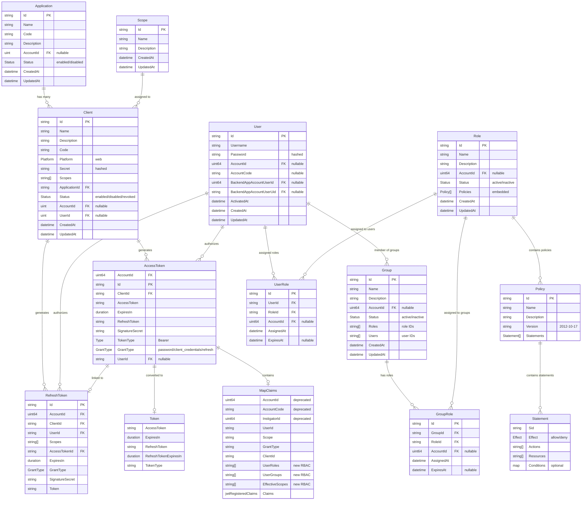

# Diagram 

## Key Relationships

  

1. **Application → Client**: One-to-Many

  

- An application can have multiple clients

- Each client belongs to one application

  

2. **Client → AccessToken**: One-to-Many

  

- A client can generate multiple access tokens

- Each access token is generated by one client

  

3. **Client → RefreshToken**: One-to-Many

  

- A client can generate multiple refresh tokens

- Each refresh token is generated by one client

  

4. **User → AccessToken**: One-to-Many

  

- A user can authorize multiple access tokens

- Each access token can be authorized by one user (nullable)

  

5. **User → RefreshToken**: One-to-Many

  

- A user can authorize multiple refresh tokens

- Each refresh token is authorized by one user

  

6. **AccessToken → RefreshToken**: One-to-One

  

- Each access token can be linked to one refresh token

- Each refresh token is linked to one access token

  

7. **Scope → Client**: Many-to-Many

- Scopes are assigned to clients as string arrays

- Multiple clients can have the same scopes

  

## Business Logic Notes

  

- **AccountId**: Used for multi-tenancy, can be null for system-level entities

- **Grant Types**:

- `password`: User credentials grant (allows refresh tokens)

- `client_credentials`: Client-only grant (no refresh tokens)

- `refresh`: Token refresh grant

- **Token Types**: Currently only supports `Bearer` tokens

- **Platforms**: Currently only supports `web` platform

- **Status**: Applications and clients have status fields for lifecycle management

- **Secrets**: Client secrets are stored as Argon2 hashes

- **Deprecated Fields**: MapClaims contains deprecated fields for backward compatibility