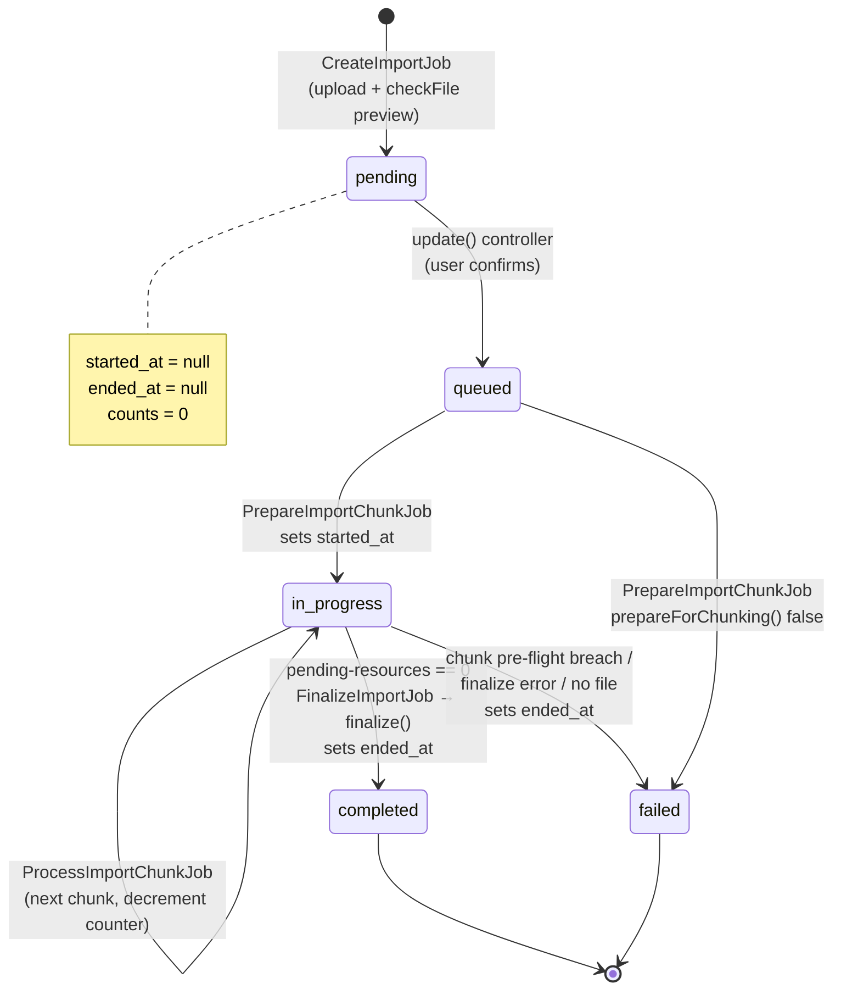
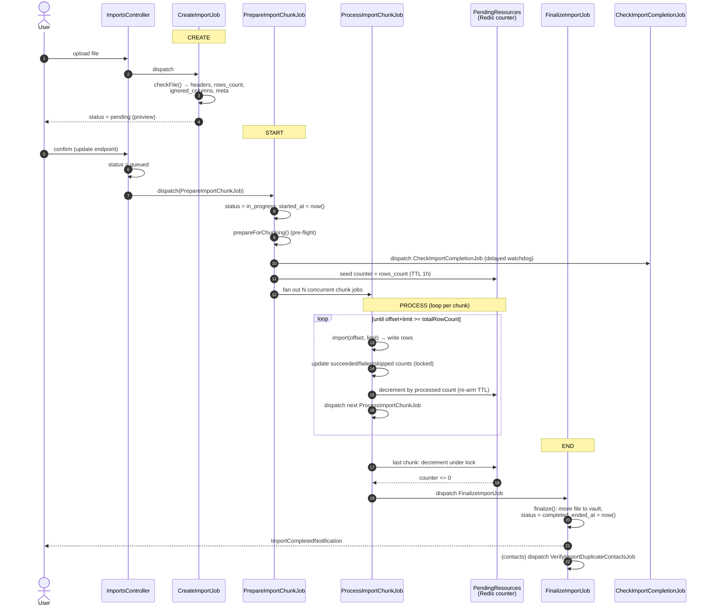

# Import model lifecycle

How an `imports` record is **created**, **started**, and **ended**, and what drives every status transition.

Model: `app/Models/Account/Import/Import.php` (types: `contacts`, `companies`, `exclusions`, `deal_meetings`, `realty_properties`).

## Key timestamps

| Field | Meaning | Set where |
|---|---|---|
| `created_at` | Record inserted (preview generated, nothing imported yet) | `CreateImportJob` |
| `started_at` | Row processing began (`queued` → `in_progress`) | `PrepareImportChunkJob.php:64` |
| `ended_at` | Reached a terminal state (`completed` **or** `failed`) | `AbstractImporter::finalize()` `:300` (success); `FinalizeImportJob:114`, `PrepareImportChunkJob:146` (failure) |

While `pending` / `queued`, both `started_at` and `ended_at` are `null`.

## Statuses

`pending` → `queued` → `in_progress` → `completed` / `failed`

- **pending** — created + validated preview only. Waits for an explicit confirm. **No auto-advance** — a record can sit here forever.
- **queued** — user confirmed; `PrepareImportChunkJob` dispatched.
- **in_progress** — pre-flight passed, chunk jobs fanned out, rows being written.
- **completed** — every row (incl. deferred duplicate rows) accounted for; `finalize()` ran.
- **failed** — pre-flight breach, finalize error, or missing file.

## State machine



> An import stuck in **pending** (like the one investigated) simply never received the confirm call — expected, not a hung job.

## Sequence



## When exactly does each happen

### Created — `CreateImportJob` (`app/Jobs/Import/CreateImportJob.php`)
- Inserts the row with `status = pending`.
- Runs `checkFile()` — a dry-run that fills `headers`, `rows_count`, `ignored_columns`, `meta` (validation preview). **No entities are imported.**
- Stores the uploaded CSV to temporary storage and fires `CreatedEvent`.

### Started — `PrepareImportChunkJob` (`app/Jobs/Import/PrepareImportChunkJob.php`)
- Triggered only after the confirm call flips `pending` → `queued` (`ImportsController::update` `:117`, dispatch `:139`).
- Sets `status = in_progress` and `started_at = now()` (`:63-65`).
- One pre-flight pass `prepareForChunking()`; on breach → `terminateAsFailed()` (`failed`, `ended_at` set).
- Seeds the Redis **pending-resources counter** with `rows_count`, dispatches the `CheckImportCompletionJob` watchdog, then fans out `ProcessImportChunkJob`s.

### Processing loop — `ProcessImportChunkJob` (`app/Jobs/Import/ProcessImportChunkJob.php`)
- Imports its slice, updates the three `rows_*_count` fields under a row lock.
- Decrements the pending-resources counter by the rows it handled; dispatches the next chunk until all rows are consumed.
- Deferred duplicate contact rows are handled by `ProcessDuplicateContactJob`, which also decrements the counter — so finalization waits for those too.

### Ended — `FinalizeImportJob` + `AbstractImporter::finalize()`
- Whichever job drives the counter to `0` dispatches `FinalizeImportJob` under a lock (`InteractsWithImportPendingResourcesTrait::decrementPendingResourcesAndFinalizeImport` `:98-102`).
- `finalize()` moves the CSV from temp → vault, sets `status = completed` and `ended_at = now()` (`AbstractImporter.php:299-300`).
- Notifies the user; for `contacts`, dispatches `VerifyImportDuplicateContactsJob` (safety-net re-check).
- **Failure path:** `FinalizeImportJob::failImportCompletion` sets `failed` + `ended_at` when the file is missing or `finalize()` throws.

### Watchdog — `CheckImportCompletionJob` (`app/Jobs/Import/CheckImportCompletionJob.php`)
- Does **not** change status. Re-dispatches every ~13 min, watching the pending-resources counter for progress.
- If the counter stalls (`MAX_STALE_CHECKS = 3`, ~39 min) past deadline, or re-check ceiling hit (`MAX_CHECKS = 200`, ~43h), it reports `NotCompletedException` to Sentry — alert only, import status untouched.

## Related
- Duplicate handling: `ProcessDuplicateContactJob`, `VerifyImportDuplicateContactsJob`, `PostImportDuplicateVerifier`
- Counter mechanics: `InteractsWithImportPendingResourcesTrait` (TTL re-arm to survive long imports)


```
  Step 0 — Pin the timeline from the import record

  Pull the record to get the exact stall window (everything else keys off started_at and the current counts).

  // against account 1390's DB — e.g. docker exec app-api php artisan tinker (prod: your access)
  Import::find(<import_id>)->only(['status','started_at','ended_at','rows_count',
    'rows_succeeded_count','rows_failed_count','rows_skipped_count','updated_at']);

  - started_at ≈ when "Processing" first showed. The gap = started_at → ~5:50 PM (resume).
  - If started_at is ~30–40 min before 5:50, that confirms the stall was after dispatch (queue layer), not in the create/confirm step. If started_at itself is ~5:50, the stall was earlier (queued never left the queue — same queue-worker cause, different job: PrepareImportChunkJob).

  Step 1 — Read the job logs for this import_id (the decisive step)

  In your log aggregator, filter import_id = <id> AND account_id = 1390, sorted by time. The chunk jobs emit these exact lines (from ProcessImportChunkJob / PrepareImportChunkJob):

  - Dispatched initial ProcessImportChunkJob jobs
  - ProcessImportChunkJob : Importing chunk.
  - Import chunk job processed, now attempting to dispatch subsequent chunk job
  - dispatched subsequent ProcessImportChunkJob

  What confirms what:

  ┌──────────────────────────────────────────────────────────────────────────────────────────────────────┬──────────────────────────────────────────────────────────────────────────────────────────┐
  │                                   Log pattern in the 30–40 min gap                                   │                                        Conclusion                                        │
  ├──────────────────────────────────────────────────────────────────────────────────────────────────────┼──────────────────────────────────────────────────────────────────────────────────────────┤
  │ dispatched subsequent ProcessImportChunkJob fires, then long silence before the next Importing chunk │ Chunk was enqueued but not picked up → worker down/starved on that queue (causes #1/#2). │
  ├──────────────────────────────────────────────────────────────────────────────────────────────────────┼──────────────────────────────────────────────────────────────────────────────────────────┤
  │ No dispatch at all after the last chunk, then it resumes                                             │ Worker died mid-job; job sat reserved until retry_after, then retried (cause #3).        │
  ├──────────────────────────────────────────────────────────────────────────────────────────────────────┼──────────────────────────────────────────────────────────────────────────────────────────┤
  │ Failed to process import chunk errors                                                                │ Chunk failures — cross-check failed_jobs (Step 2).                                       │
  ├──────────────────────────────────────────────────────────────────────────────────────────────────────┼──────────────────────────────────────────────────────────────────────────────────────────┤
  │ Last line is Dispatched initial… with nothing after                                                  │ Both starting chains landed on a stuck queue.                                            │
  └──────────────────────────────────────────────────────────────────────────────────────────────────────┴──────────────────────────────────────────────────────────────────────────────────────────┘

  Also grab the queue connection name on those job log entries (the queue-N the job ran on). That name is what you'll check in Step 3.

  Step 2 — Check failed_jobs (core DB)

  Failed/retried chunks land here (config/queue.php:50 → core DB, failed_jobs table):

  SELECT id, queue, failed_at, exception
  FROM failed_jobs
  WHERE payload LIKE '%ProcessImportChunkJob%'
    AND failed_at BETWEEN '2026-07-16 17:00' AND '2026-07-16 18:00'  -- your window
  ORDER BY failed_at;

  - Rows here with matching timestamps → confirms cause #3 (deaths/retries), and exception tells you OOM vs timeout vs other.
  - Empty → the jobs never failed, they just weren't consumed → points to #1/#2 (queue idle/starved), not code.

  Step 3 — Correlate with worker/queue health in that window

  This is what discriminates #1 vs #2. For the specific queue-N connection identified in Step 1, check for 17:10–17:50:

  - Worker uptime / restarts (Horizon dashboard, supervisor/systemd logs, or pod restart events). A worker down/restarting in that window → cause #1.
  - Queue depth for that connection (Redis LLEN <queue-name>, or Horizon metrics). Depth climbing then draining at ~5:50 → backlog.
  - What else ran on that worker — a single long job occupying it (bulk action, export, migration, or a long DB lock like the email processed_at update from your earlier session) → cause #2.
  - Deploy events — was 1.155.0 (or any restart) rolled out then? → cause #4.

  Step 4 — Sentry cross-check

  Search Sentry for NotCompletedException with importId = <id> / accountId = 1390. The watchdog trips at MAX_STALE_CHECKS = 3 ≈ 39 min of no counter progress — right at your stall length. Presence (or a logged Import is not completed that then cleared) independently confirms a genuine ~39-min no-progress stall rather
  than a UI glitch.

  ---
  Fast path: Steps 1 + 2 alone usually settle it — logs show enqueued-but-not-run (queue idle) vs failed-and-retried (worker death). Step 3 then names the specific queue/worker cause.

  If you can paste the log timeline for the import_id (and its queue-N), or you have access to the prod DB/log tooling I can query through, I'll pinpoint the exact cause rather than the category. Do you know the import_id?
```