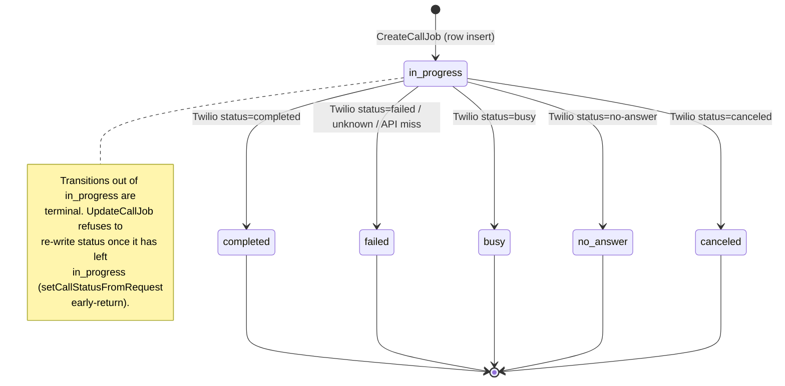
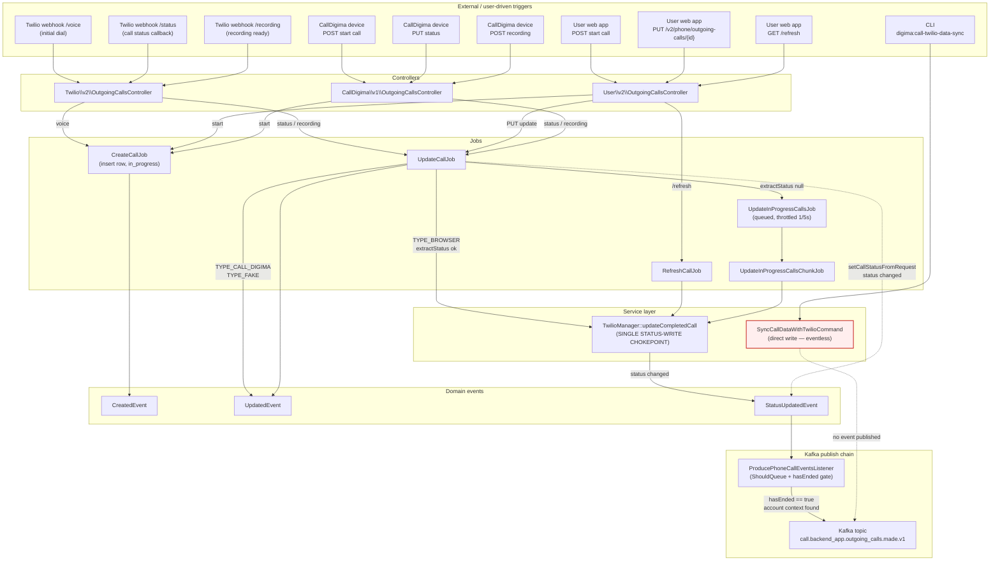
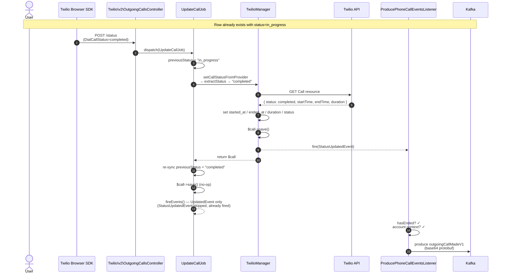
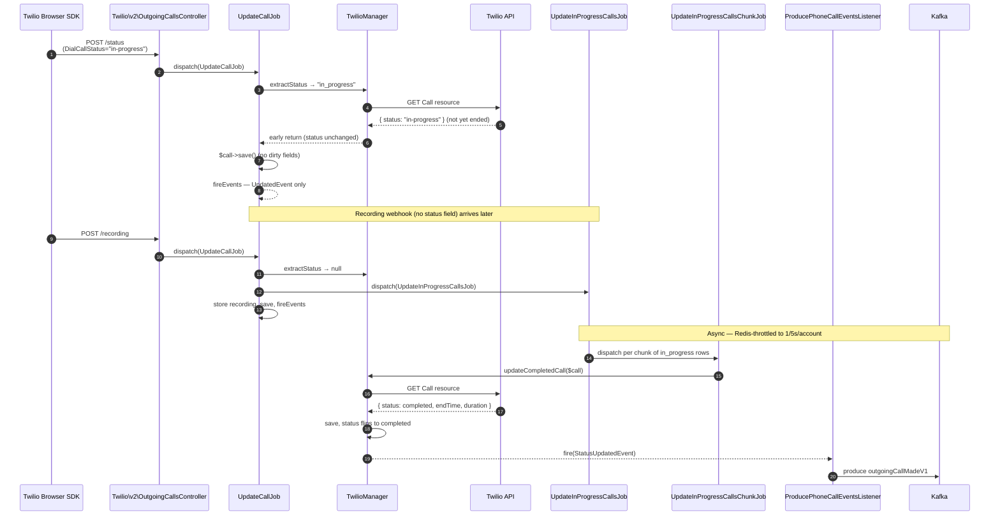
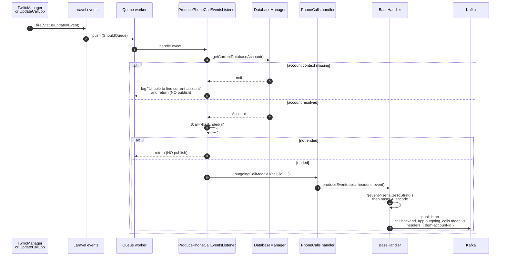

# Outgoing call flow

End-to-end logic for `phone_outgoing_calls`: insertion, status transitions, event dispatching, and Kafka publication.

## Lifecycle summary

1. **User dials** → row inserted with `status = in_progress`, `started_at = now()`, `ended_at = null`.
2. **Call ends** → status transitions to one of `completed | failed | busy | no_answer | canceled` and `ended_at`, `duration` are populated.
3. **Status-change events** are fanned out as Kafka messages on `call.backend_app.outgoing_calls.made.v1`.

Statuses are defined in `app/Models/Account/Phone/Call/AbstractCall.php`. Ending statuses returned by `AbstractCall::getEndingStatuses()`.

## State diagram — status transitions



## Use-case overview — triggers → jobs → events



## Sequence — Browser call, happy path (Twilio status callback flips to completed)



## Sequence — Browser call, sweep path (the 741154 scenario)

This is what actually happens when Twilio's status callback arrives **before** the Twilio API reflects the terminal state. Historically eventless; now fixed because the manager fires the event itself.



## Sequence — CallDigima device call (status not from Twilio)

```mermaid
sequenceDiagram
    autonumber
    actor Mobile as CallDigima device
    participant Ctrl as CallDigima\v1\OutgoingCallsController
    participant Update as UpdateCallJob
    participant Listener as ProducePhoneCallEventsListener
    participant Kafka

    Mobile->>Ctrl: PUT /v1/.../outgoing-calls/{id}<br/>{ status: completed }
    Ctrl->>Update: dispatch_sync(UpdateCallJob)
    Update->>Update: type == TYPE_CALL_DIGIMA<br/>→ setCallStatusFromRequest
    Update->>Update: previousStatus = "in_progress"
    Update->>Update: $call->status = "completed"
    Update->>Update: $call->save()
    Update-->>Listener: fire(StatusUpdatedEvent)
    Note over Listener: hasEnded() requires ended_at;<br/>device flow does NOT set ended_at →<br/>listener returns early, no Kafka.
    Listener-->>Kafka: (no publish)
```

> ⚠️ **Known gap for `TYPE_CALL_DIGIMA` / `TYPE_FAKE`:** `setCallStatusFromRequest` only updates `status`, never `ended_at`. `ProducePhoneCallEventsListener` requires `hasEnded()` = isEndedStatus + ended_at. So mobile / fake calls do not produce a Kafka event from this path unless something else later sets `ended_at` (e.g. recording upload).

## Sequence — User PUT to set outcome on already-completed call

```mermaid
sequenceDiagram
    autonumber
    actor User
    participant Web as Web app
    participant Ctrl as User\v2\OutgoingCallsController
    participant Update as UpdateCallJob
    participant Listener as ProducePhoneCallEventsListener

    Note over User,Listener: Row is already status=completed
    User->>Web: select outcome, save
    Web->>Ctrl: PUT /v2/phone/outgoing-calls/{id}<br/>{ call_outcome_id: 61 }
    Ctrl->>Update: dispatch_sync(UpdateCallJob)
    Update->>Update: previousStatus = "completed"
    Update->>Update: setCallStatus → setCallStatusFromProvider<br/>extractStatus null → dispatch SweepJob, return
    Update->>Update: applyCallOutcome → set call_outcome_id
    Update->>Update: $call->save()
    Update-->>Listener: fireEvents — UpdatedEvent + OutcomeAppliedEvent<br/>(status unchanged → no StatusUpdatedEvent)
    Note over Listener: No Kafka publish here — status didn't change.<br/>The outcome change does not produce a phone-call event;<br/>OutcomeAppliedEvent is handled separately.
```

## Sequence — Kafka publish chain (zoom-in on listener)



## Entry points

### Insertion (creation)

| Trigger                              | Controller                                                             | Job                                      |
| ------------------------------------ | ---------------------------------------------------------------------- | ---------------------------------------- |
| User web app initiates dial          | `Http/Controllers/User/v2/Phone/Call/Outgoing/OutgoingCallsController` | `Jobs/Phone/Call/Outgoing/CreateCallJob` |
| Twilio browser SDK voice webhook     | `Http/Controllers/Twilio/v2/Call/OutgoingCallsController::voice()`     | `Jobs/Phone/Call/Outgoing/CreateCallJob` |
| CallDigima mobile device starts call | `Http/Controllers/CallDigima/v1/OutgoingCallsController`               | `Jobs/Phone/Call/Outgoing/CreateCallJob` |

`CreateCallJob::handle()`:
- Deletes existing callbacks/restrictions for the contact.
- Determines `type` (`browser`, `call_digima`, or `fake`).
- Inserts the `OutgoingCall` row with `status = in_progress`.
- Marks the call token as used.
- For campaign calls, increments `calls_count` and updates `has_reached_call_limit`.
- Fires `Events\Phone\Call\Outgoing\CreatedEvent`.
- Logs `"Outgoing phone call created"`.
- **No Kafka event is published on creation.**

### Update (status transition, outcome, recording)

| Trigger | Controller | Job |
|---------|------------|-----|
| Twilio status callback webhook | `Twilio/v2/.../OutgoingCallsController::status()` | `UpdateCallJob` |
| Twilio recording callback webhook | `Twilio/v2/.../OutgoingCallsController::recording()` | `UpdateCallJob` |
| User web app PUT (outcome / notes / status) | `User/v2/.../OutgoingCallsController::update()` | `UpdateCallJob` |
| User web app GET /refresh | `User/v2/.../OutgoingCallsController::refresh()` | `RefreshCallJob` |
| CallDigima device status update | `CallDigima/v1/OutgoingCallsController::updateStatus()` | `UpdateCallJob` |
| CallDigima device recording upload | `CallDigima/v1/OutgoingCallsController::uploadRecording()` | `UpdateCallJob` |
| Self-dispatched (sweep stuck rows) | `UpdateCallJob::setCallStatusFromProvider()` when `extractStatus()` returns null | `UpdateInProgressCallsJob` (queued, Redis-throttled 1/5s per account) → `UpdateInProgressCallsChunkJob` |
| Scheduled CLI sync | `digima:call-twilio-data-sync` | `Console/Commands/Call/SyncCallDataWithTwilioCommand` (direct writes, no job) |

## `UpdateCallJob::handle()` internals

1. `fill()` writable attributes (e.g. `notes`).
2. Capture `previousStatus`.
3. `setCallStatus()` dispatches by call `type`:
   - `TYPE_BROWSER` → `setCallStatusFromProvider()`:
     - `TwilioManager::extractStatus($attributes)` reads `DialCallStatus` / `CallStatus`.
     - If **null**, dispatch `UpdateInProgressCallsJob` and return.
     - Else, call `TwilioManager::updateCompletedCall($call)`.
     - After return, **re-sync `previousStatus` to current status** so `fireEvents()` doesn't double-fire (the manager fires `StatusUpdatedEvent` itself now).
   - `TYPE_CALL_DIGIMA` / `TYPE_FAKE` → `setCallStatusFromRequest()`:
     - Only acts when row is still `in_progress`.
     - Reads `status` from the request directly. Sets `$call->status`.
     - Does **not** set `ended_at`.
4. If campaign call, update contact availability flags.
5. Store recording file if applicable (`storeRecordingFromProvider` / `storeRecordingFromMobile`).
6. Apply call outcome if `call_outcome_id` is present.
7. `$call->save()`.
8. `fireEvents()`:
   - `Events\Phone\Call\Outgoing\UpdatedEvent` (always).
   - `Events\Phone\Call\Outgoing\StatusUpdatedEvent` (only when status changed in this invocation).
   - `Events\Call\Outcome\AppliedEvent` (when outcome changed).
9. Notify device if `TYPE_CALL_DIGIMA` and ended.
10. Log `"Outgoing phone call updated"`.

## `TwilioManager::updateCompletedCall()`

Single chokepoint for browser-type status writes. Located in `app/Services/Phone/TwilioManager.php`.

```
getCall() → null         → return null (no write)
Twilio status == current → return early (no write)
                         → set started_at, ended_at, duration, status
                         → $call->save()
                         → fire(StatusUpdatedEvent)   ◄── plugs eventless callers
                         → updateCallsCount (failed/canceled + campaign)
                         → releaseContact (any ended status)
```

Twilio → Digima status map (`getDigimaStatus`):

| Twilio | Digima |
|--------|--------|
| `completed` | `STATUS_COMPLETED` |
| `answered`, `queued`, `initiated`, `ringing`, `in-progress` | `STATUS_IN_PROGRESS` |
| `busy` | `STATUS_BUSY` |
| `no-answer` | `STATUS_NO_ANSWER` |
| `failed` | `STATUS_FAILED` |
| `canceled` | `STATUS_CANCELED` |
| anything else | `STATUS_FAILED` (default) |

## Sweep job (UpdateInProgressCallsJob)

`Jobs/Phone/Call/Outgoing/UpdateInProgressCallsJob`:
- Queued; Redis-throttled to 1 invocation per account per 5 seconds (`account.{id}.job.UpdateInProgressCallsJob`).
- Queries `OutgoingCall` where `status = in_progress`, chunks by `chunkById(config('call.update_chunk_size'))`.
- Dispatches `UpdateInProgressCallsChunkJob` per chunk.

`UpdateInProgressCallsChunkJob`:
- Iterates each call and invokes `$phoneManager->updateCompletedCall($call)`.
- Itself fires no events — events come from the manager now.

This is the path that ran for call 741154 on 2026-05-20 between 08:17:23 and 08:17:26 — historically eventless, now covered by the manager's `fire(StatusUpdatedEvent)`.

## Event → Kafka chain

```
StatusUpdatedEvent
  └─► Listeners\Event\ProducePhoneCallEventsListener::whenOutgoingCallStatusUpdated
        (implements ShouldQueue — runs in queue worker)
        │
        ├─ DatabaseManager::getCurrentDatabaseAccount() must resolve
        │   → else logs "Unable to find current account" and returns silently
        ├─ $call->hasEnded() guard (isEndedStatus + ended_at is not null)
        └─ PhoneCalls::outgoingCallMadeV1()
              └─► BaseHandler::produceEvent
                    Topic:   call.backend_app.outgoing_calls.made.v1
                    Headers: { dgm-account-id }
                    Body:    base64( protobuf bytes )       ◄── consumer must base64-decode
                    Schema:  OutgoingCallMadeEventV1 {
                              call_id, started_at, ended_at,
                              is_mobile, duration, status (enum)
                            }
```

Status enum mapping in `app/Services/EventProducer/Handlers/PhoneCalls.php`:

| Digima | Protobuf |
|--------|----------|
| `STATUS_COMPLETED` | `STATUS_COMPLETED` |
| `STATUS_FAILED` | `STATUS_FAILED` |
| `STATUS_CANCELED` | `STATUS_CANCELLED` |
| `STATUS_NO_ANSWER` | `STATUS_NO_ANSWER` |
| `STATUS_BUSY` | `STATUS_BUSY` |
| anything else | `STATUS_UNSPECIFIED` |

Incoming-call counterpart: topic `call.backend_app.incoming_calls.made.v1`, schema `IncomingCallMadeEventV1`.

## Still-eventless paths

| Path | Reason | Acceptable? |
|------|--------|-------------|
| `Console\Commands\Call\SyncCallDataWithTwilioCommand::updateOutgoingCall` | Writes `started_at` / `ended_at` / `duration` / `status` directly with `$call->save()`. Bypasses the manager. | Only run as an operator tool. If anyone runs it in prod, those rows don't publish. |
| `Migration\Traits\PhoneCallsSetup` | One-time backfill at account onboarding. | Yes — backfill should not double-publish. |

## Multi-tenant note

This monolith is per-account-database. The current account DB connection is resolved by `Services\DatabaseManager::getCurrentDatabaseAccount()` and stored in `config('database.account_id')`. The Kafka listener is `ShouldQueue`, so the queue worker must rebind the tenant DB before the listener fires; otherwise the listener no-ops with `"Unable to find current account"` and the event is dropped.

When debugging missing Kafka messages, grep prod logs for that string near the affected timestamp.

## Debugging checklist for "missing Kafka event"

1. Grep logs for the call id around the expected end time.
2. Confirm there's an entry where status transitioned `in_progress` → terminal in the same job invocation (or via the manager).
3. If only `UpdateCallJob` recording-callback logs exist with status already terminal, the actual transition happened either:
   - inside `TwilioManager::updateCompletedCall()` (look for `releaseContact` / `updateCallsCount` side effects), or
   - in a CLI/migration path.
4. Check queue worker logs for `"Unable to find current account"`.
5. Check `failed_jobs` for `ProducePhoneCallEventsListener` failures.
6. Confirm the consumer base64-decodes the message body before protobuf parsing.

## File index

| File | Purpose |
|------|---------|
| `app/Models/Account/Phone/Call/OutgoingCall.php` | Eloquent model, status constants via `AbstractCall` |
| `app/Models/Account/Phone/Call/AbstractCall.php` | Status constants, `hasEnded()`, `isEndedStatus()`, `getEndingStatuses()` |
| `app/Jobs/Phone/Call/Outgoing/CreateCallJob.php` | Insertion |
| `app/Jobs/Phone/Call/Outgoing/UpdateCallJob.php` | Status / outcome / recording updates |
| `app/Jobs/Phone/Call/Outgoing/RefreshCallJob.php` | Manual refresh from UI |
| `app/Jobs/Phone/Call/Outgoing/UpdateInProgressCallsJob.php` | Stuck-row sweep (throttled) |
| `app/Jobs/Phone/Call/Outgoing/UpdateInProgressCallsChunkJob.php` | Per-chunk processor |
| `app/Services/Phone/TwilioManager.php` | Twilio API calls, `updateCompletedCall`, status mapping, fires `StatusUpdatedEvent` |
| `app/Services/Phone/AbstractPhoneManager.php` | Manager interface |
| `app/Events/Phone/Call/Outgoing/CreatedEvent.php` | Fired by `CreateCallJob` |
| `app/Events/Phone/Call/Outgoing/UpdatedEvent.php` | Fired by `UpdateCallJob`, `RefreshCallJob` |
| `app/Events/Phone/Call/Outgoing/StatusUpdatedEvent.php` | Fired by `TwilioManager` and `UpdateCallJob` |
| `app/Listeners/Event/ProducePhoneCallEventsListener.php` | Subscribes `StatusUpdatedEvent`, publishes to Kafka |
| `app/Services/EventProducer/Handlers/PhoneCalls.php` | Kafka topic constants, protobuf assembly |
| `app/Services/EventProducer/Handlers/BaseHandler.php` | `produceEvent`, base64-encodes body |
| `app/Providers/EventServiceProvider.php` | Registers `ProducePhoneCallEventsListener` (line ~277) |
| `app/Http/Controllers/Twilio/v2/Call/OutgoingCallsController.php` | Twilio webhooks (voice / status / recording) |
| `app/Http/Controllers/User/v2/Phone/Call/Outgoing/OutgoingCallsController.php` | Web app endpoints |
| `app/Http/Controllers/CallDigima/v1/OutgoingCallsController.php` | Mobile device endpoints |
| `app/Console/Commands/Call/SyncCallDataWithTwilioCommand.php` | CLI sync (still eventless) |
