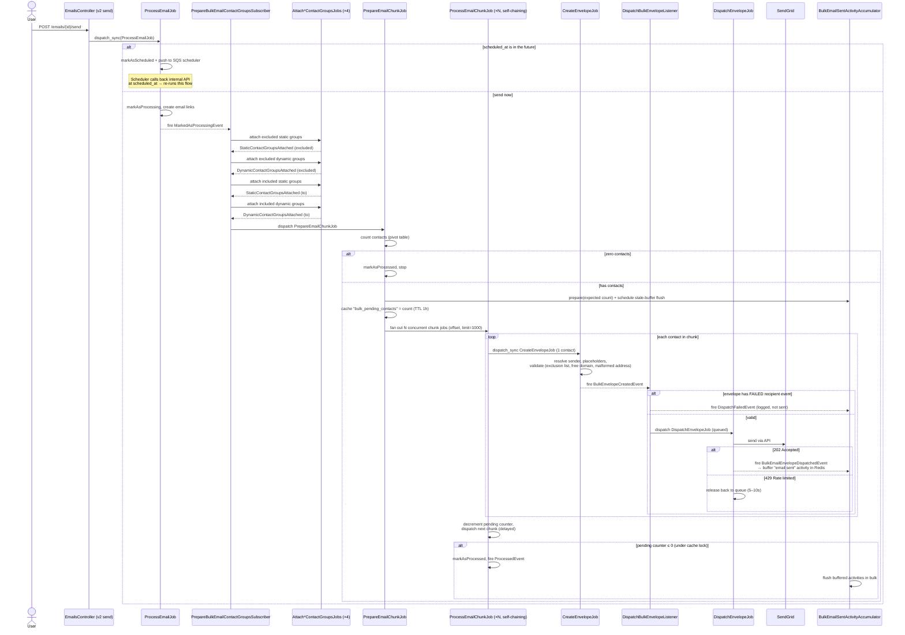

# Bulk email flow

End-to-end logic for bulk emails (`Email::TYPE_BULK`): recipient resolution from contact groups, chunked envelope creation, throttled SendGrid dispatch, and buffered activity logging.

A bulk email is one `Email` record with `type = 'bulk'` (`app/Models/Account/Email/Email.php:150`), targeted at **contact groups** (static or dynamic) instead of individual to/cc/bcc contacts. Each matched contact gets their **own `Envelope`** (personalized sender, placeholder data, unsubscribe footer), sent individually via SendGrid. SLA: sent within 1 hour.

## Key configuration

| Setting | Source | Default | Clamp |
|---|---|---|---|
| Chunk size | `config('mail.bulk.chunk_size')` / `CONCURRENT_JOB_PARALLEL_CHUNK_SIZE_BULK_MAIL` | 1000 | — |
| Concurrency | Account `Setting::KEY_BULK_EMAIL`, fallback `CONCURRENT_JOB_PARALLEL_COUNT_BULK_MAIL` | 2 | 1–500 |
| Inter-chunk delay (s) | Account `Setting::KEY_BULK_EMAIL`, fallback `CONCURRENT_JOB_PARALLEL_TIME_INTERVAL_BULK_MAIL` | 2 | 0–100 |

## Lifecycle summary

1. **User sends** → `POST /v2/emails/{id}/send` → `ProcessEmailJob` (sync). If `scheduled_at` is in the future → `markAsScheduled` + push to SQS scheduler microservice, which calls back `/v2/emails/{id}/send-scheduled` at the right time.
2. **Recipient resolution** → `MarkedAsProcessingEvent` starts an event-chained sequence in `PrepareBulkEmailContactGroupsSubscriber`: excluded-static → excluded-dynamic → included-static → included-dynamic groups. Excluded first (so includes can be filtered), dynamic "to" last (membership computed at send time).
3. **Chunking** → `PrepareEmailChunkJob` counts recipients from the pivot table, seeds the `bulk_pending_contacts` cache counter (TTL 1h), prepares the activity accumulator, and fans out N concurrent `ProcessEmailChunkJob` chains via `ConcurrentJobDispatcher`.
4. **Envelope per contact** → each chunk job pages its slice and runs `CreateEnvelopeJob` synchronously per contact: sender resolution, placeholder data, pre-flight checks (free email domain, empty/malformed address, exclusion list, missing placeholders). Failures create the envelope with a `failed` recipient event (visible in stats) but are never sent.
5. **Dispatch** → `BulkEnvelopeCreatedEvent` → `DispatchBulkEnvelopeListener` (queued) → `DispatchEnvelopeJob` → SendGrid. `202` = mark recipients dispatched + fire `BulkEmailEnvelopeDispatchedEvent`; `429` = release back to queue with 5–10s jitter.
6. **Completion** → each finished chunk decrements the counter and dispatches the next chunk (delayed). When the counter hits zero (under cache lock), email is `markAsProcessed` and `ProcessedEvent` fires.
7. **Activity logging** → `BulkEmailSentActivityAccumulator` buffers "email sent" activities in Redis and bulk-flushes them, instead of one DB row per recipient. `FlushStaleBulkEmailSentActivityBufferJob` force-flushes buffers idle 10 min or older than 2 h.

## Sequence diagram

## Key files

| Role | File |
|---|---|
| Entry point (send) | `app/Http/Controllers/User/v2/Email/EmailsController.php:146` |
| Orchestrator / scheduling | `app/Jobs/Email/ProcessEmailJob.php` |
| Group resolution chain | `app/Listeners/Email/PrepareBulkEmailContactGroupsSubscriber.php` |
| Chunk fan-out | `app/Jobs/Email/PrepareEmailChunkJob.php` |
| Chunk processing (self-chaining) | `app/Jobs/Email/ProcessEmailChunkJob.php` |
| Envelope creation + validation | `app/Jobs/Email/Envelope/CreateEnvelopeJob.php` (via `Services/Email/EnvelopeCreator.php`) |
| Dispatch gate (domain/failed check) | `app/Listeners/Email/Envelope/AbstractDispatchEnvelopeListener.php`, `DispatchBulkEnvelopeListener.php` |
| SendGrid send | `app/Jobs/Email/Envelope/DispatchEnvelopeJob.php` |
| Activity buffering | `app/Services/Email/BulkEmailSentActivityAccumulator.php`, `app/Listeners/Email/Bulk/LogActivitySubscriber.php` |
| Stale buffer safety net | `app/Jobs/Email/FlushStaleBulkEmailSentActivityBufferJob.php` |
| Config | `config/mail.php` (`mail.bulk.*`) |

## Gotchas

- **"Processed" ≠ "sent".** `markAsProcessed` means all envelopes were *created*; actual SendGrid sends happen later on the queue, per envelope.
- **Counter can leak.** Completion detection relies on the Redis `bulk_pending_contacts` counter (TTL 1h). If a chunk job dies hard, its `failed()` hook decrements by 0, so the counter never reaches zero and the email stays "processing" until TTL + stale-flush cleanup.
- **Dynamic groups snapshot at send time.** A group that matched thousands of contacts at preview can resolve to 0 at send — hence the explicit zero-contacts early exit in `PrepareEmailChunkJob` (see PR #3774).
- **Failed envelopes still exist.** Pre-flight failures (exclusion list, free domain, malformed address, missing placeholder) create the envelope with a `failed` event so they appear in statistics, but the dispatch listener never sends them.

## Related

- [[Classic vs bulk email]]
- [[Outgoing call flow]]
