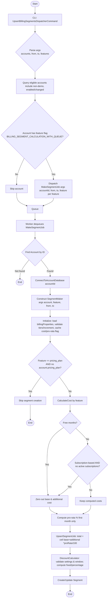

## Publisher

## Job Handler
First we have to `registerWorkerRoutes`

Check the current Segment model
 -

Queue batch segment calculator

1. Pricing plan model is just a template, the account pricing plan will be the associated billing plan for account. And we copy the properties of the template to it with a freedom to modify for a specific accnt

# Prorated?
