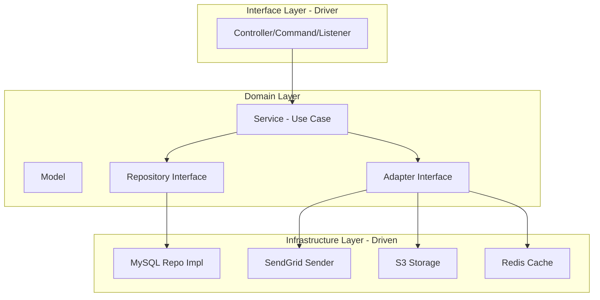

## **Project Overview**

The **Digima Backend Email API** is a sophisticated **gRPC-based microservice** written in **Go** that provides comprehensive email processing capabilities for the Digima application. It serves as the backend email engine that handles both sending and receiving emails through various protocols.

## **Core Purpose & Features**

### **Primary Functions:**

1. **Email Sending**: Sends emails using users' SMTP servers
2. **Email Synchronization**: Syncs emails using users' IMAP servers
3. **Email Tracking**: Tracks email opens, clicks, and engagement
4. **Connection Management**: Manages email account connections (IMAP/SMTP)
5. **OAuth2 Integration**: Supports OAuth2 authentication for Gmail and Microsoft
6. **Attachment Handling**: Manages email attachments with cloud storage
7. **Email Scheduling**: Supports scheduled email sending
8. **Thread Management**: Handles email threads and conversations

## **Technical Architecture**

### **Technology Stack:**

- **Language**: Go 1.22
- **Architecture**: Clean Architecture with DDD (Domain-Driven Design)
- **Communication**: gRPC with Protocol Buffers
- **Database**: MySQL with GORM ORM
- **Email Protocols**: IMAP, SMTP
- **Authentication**: OAuth2 (Google, Microsoft), Basic Auth
- **Storage**: AWS S3 for attachments
- **Caching**: Redis/FreeCache
- **Queue**: Message queue system for async processing
- **Security**: HashiCorp Vault for credentials storage

### **Project Structure:**

digima-backend-email-api/
```
digima-backend-email-api/
├── app/           # Application layer (providers, config, errors)
├── domain/        # Domain layer (models, services, repositories)
├── infra/         # Infrastructure layer (SMTP, IMAP, storage)
├── interface/     # Interface layer (controllers, forms, transformers)
└── tests/         # Test suites
```


## **What Drives This Project (Drivers)**

### **Business Drivers:**

1. **Email Marketing & Communication**: Enable users to send marketing emails and track engagement
2. **Multi-Provider Support**: Support various email providers (Gmail, Outlook, custom SMTP)
3. **Enterprise Features**: Advanced tracking, scheduling, and analytics
4. **Scalability**: Handle high-volume email processing
5. **Security**: Secure credential management and OAuth2 integration

### **Technical Drivers:**

1. **Microservice Architecture**: Decoupled, scalable email service
2. **Protocol Flexibility**: Support both IMAP and SMTP protocols
3. **Async Processing**: Queue-based email processing for performance
4. **Clean Architecture**: Maintainable and testable code structure
5. **gRPC Performance**: High-performance communication protocol

## **What This Project Drives (Driven)**

### **Core Domain Models:**

1. **Envelope**: Represents individual emails (sent/received)
2. **Connection**: Email account connections (IMAP/SMTP settings)
3. **Email**: Composed emails (drafts, scheduled, sent)
4. **Attachment**: Email attachments stored in cloud
5. **Authorization**: OAuth2 authorizations for email providers
6. **Link**: Trackable links in emails
7. **Click/Open**: Email engagement tracking events

### **Key Services:**

1. **EnvelopeService**: Manages email envelopes and threads
2. **ConnectionService**: Handles email account connections
3. **EmailService**: Manages email composition and sending
4. **AttachmentService**: Handles file attachments
5. **AuthorizationService**: Manages OAuth2 flows

### **Infrastructure Components:**

1. **SMTP Client**: Sends emails via SMTP servers
2. **IMAP Client**: Syncs emails from IMAP servers
3. **Queue System**: Async job processing
4. **Storage**: Cloud file storage for attachments
5. **Vault**: Secure credential storage

## **Key Capabilities**

### **Email Processing Flow:**

1. **Connection Setup**: Users connect their email accounts (OAuth2/Basic)
2. **Email Composition**: Create emails with attachments, tracking, scheduling
3. **Sending**: Process emails through SMTP with tracking injection
4. **Synchronization**: Sync sent/received emails via IMAP
5. **Tracking**: Track opens, clicks, and engagement
6. **Analytics**: Provide email performance metrics

### **Advanced Features:**

- **Thread Management**: Groups related emails into conversations
- **Email Scheduling**: Send emails at specific times
- **Link Tracking**: Track clicks on links in emails
- **Open Tracking**: Track when emails are opened
- **Attachment Management**: Store and serve email attachments
- **Multi-Provider Support**: Gmail, Outlook, custom SMTP/IMAP
- **Security**: Vault-based credential storage, OAuth2 flows

## **Integration Points**

The service integrates with:

- **Digima Main Application**: Primary business logic
- **Email Providers**: Gmail, Microsoft, custom SMTP/IMAP
- **Storage Systems**: AWS S3 for attachments
- **Queue Systems**: For async processing
- **Vault**: For secure credential management
- **Database**: MySQL for persistent data

This is a **production-ready, enterprise-grade email processing microservice** that provides the email backbone for the Digima application, handling everything from simple email sending to complex email marketing campaigns with full tracking and analytics capabilities.




## Sent flow
