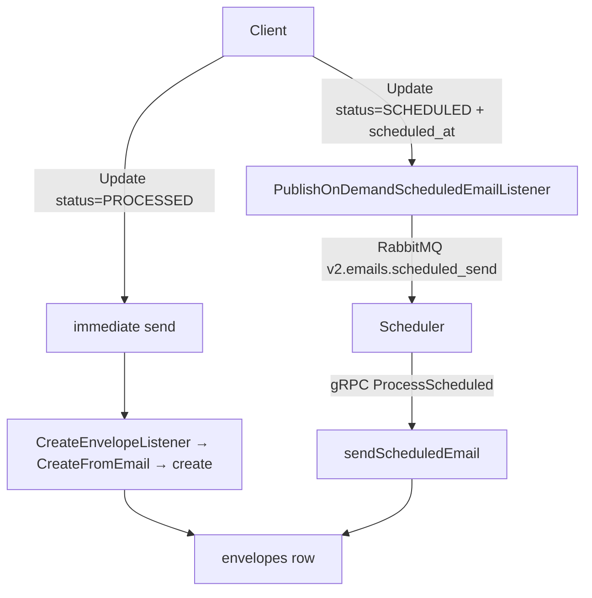
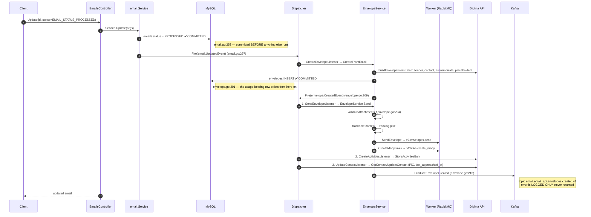
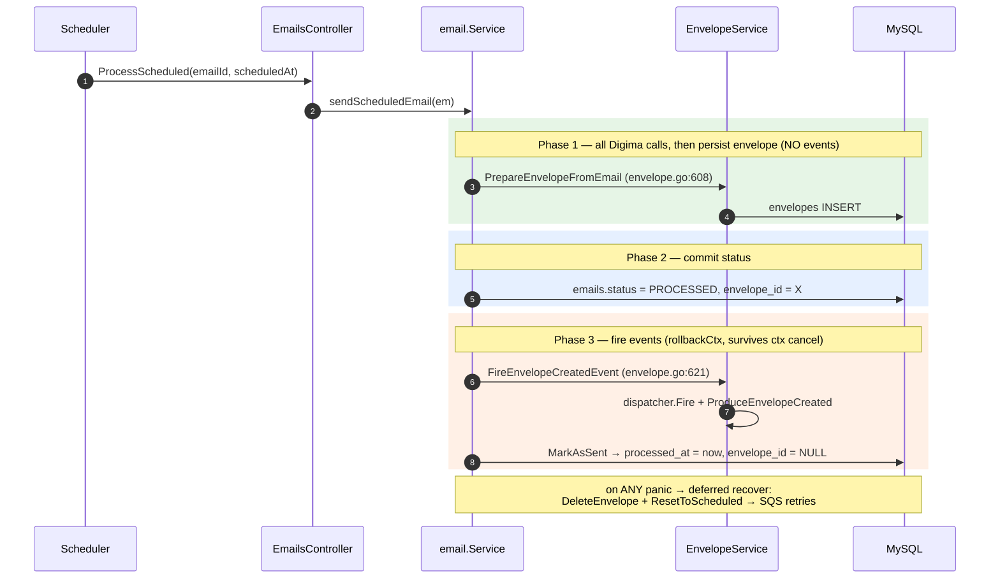

# Email send flow (email-api)

Full trace of what happens between "user clicks send" and "the envelope row exists".
Companion notes: [[sequence]] (worker side), [[Email usage]] (what counts as usage), [[dependencies]].

All file:line refs are `digima-backend-email-api` @ `develop` (2026-08-10).

---

## 1. The mental model

There is **no `Send` RPC**. `EmailsService` only exposes:

`Create` / `List` / `Show` / `Update` / `Delete` / `SendScheduled` / `ProcessScheduled`
→ `interface/resources/emails/grpc/v1/controller.go`

Sending = **a status transition on the `emails` resource**:

| Records | Meaning |
|---|---|
| `emails` | the draft/compose record. Status: `DRAFT` → `SCHEDULED` → `PROCESSED` |
| `envelopes` | the immutable "this was actually sent/received" record. Created at send time. **This is what usage counts.** |
| `attachment_resources` | pivot linking attachments to email or envelope |

So: **`Update(status = EMAIL_STATUS_PROCESSED)` is the send button.**

---

## 2. Two entry points



Both listeners sit on the **same** `email.UpdatedEvent` (`app/providers/event.go:33-40`) and are separated only by status:

- `CreateEnvelopeListener` — acts when `UpdatedEmail.Status == PROCESSED && OriginalEmail.Status != PROCESSED` (`interface/listeners/envelope/create.go:32`)
- `PublishOnDemandScheduledEmailListener` — acts when status is *not* PROCESSED and `scheduled_at` changed (`interface/listeners/email/publish_scheduled.go:35-47`)

⚠️ These two paths **do not share rollback behaviour**. See §5.

---

## 3. Path A — immediate send (`EmailsService/Update`)



### Order inside `create()` — `domain/services/email/envelope.go:200-218`

```
1. EnvelopesRepository.Create   :201   ← row committed
2. dispatcher.Fire(CreatedEvent):209   ← send + activity + contact (synchronous, panics propagate)
3. ProduceEnvelopeCreated       :213   ← Kafka, log-only on error
```

The dispatcher runs listeners **sequentially with no recover** (framework `dispatcher/dispatcher.go:58-70`), in registration order:

| # | Listener | Does | On failure |
|---|---|---|---|
| 1 | `SendEnvelopeListener` | validate attachments, tracking, publish to worker | panic |
| 2 | `CreateActivitiesListener` | Digima `StoreActivitiesBulk` (`contact_email_inbox_sent`) | panic |
| 3 | `UpdateContactListener` | Digima contact PiC + `last_approached_at` | panic |

A panic in listener *n* means listeners *n+1…* **and the Kafka produce at :213** never run — while the envelope row is already committed.

---

## 4. Path B — scheduled send (`ProcessScheduled` → `sendScheduledEmail`)

`domain/services/email/email.go:442-508`. This path was hardened (PR #500) and is explicitly 3-phase:



Safety nets this path has and Path A does not:

- `defer recover()` → `DeleteEnvelope` + `ResetToScheduled` (`email.go:449-471`)
- `envelope_id` persisted in phase 2 so orphans are findable
- `RecoverStuckProcessedEmails` (`email.go:392`) — sweeps `status = PROCESSED AND processed_at IS NULL`, deletes the orphan envelope, resets to `SCHEDULED`

---

## 5. Path A vs Path B

| | Path A `Update` | Path B `ProcessScheduled` |
|---|---|---|
| Envelope created by | `create()` (`envelope.go:200`) | `PrepareEnvelopeFromEmail` (`:608`) |
| Events fired | inside `create()` | separately, `FireEnvelopeCreatedEvent` (`:621`) |
| Rollback on failure | ❌ **none** | ✅ delete envelope + reset status |
| Recovery job | ❌ none | ✅ `RecoverStuckProcessedEmails` |
| Result of a mid-chain failure | orphan envelope, email stuck `PROCESSED` | clean retry |

---

## 6. Kafka events (fire-and-forget)

`infra/producer/kafka/client.go`, topics in `app/config/event/config.go`:

- `email.email_api.envelopes.created.v1`
- `email.email_api.envelopes.bulk_deleted.v1`
- `email.email_api.clicks.created.v1`
- `email.email_api.attachments.created.v1`
- `email.email_api.attachments.bulk_deleted.v1`

Every message carries the header `dgm-account-id`, read from the auth token in ctx (`client.go:155`) — **no token in ctx ⇒ produce fails before Kafka is even contacted**.

Both produce call sites swallow the error (`envelope.go:213-215`, `:630-632`): logged, never returned, no retry, no outbox. There is no `published` column on `envelopes`, so **an envelope row tells you nothing about whether its event was published**. If delivery must be guaranteed → outbox pattern.

---

## 7. Failure modes — what state you end up with

| Where it breaks | envelope row | Kafka event | email status | User sees |
|---|---|---|---|---|
| `buildEnvelopeFromEmail` (Digima down) | none | — | already `PROCESSED` ⚠️ | error |
| `SendEnvelopeListener` (Path A) | ✅ orphan | ❌ | `PROCESSED` ⚠️ | error, but "sent" in UI, **not delivered** |
| Activity/Contact listener (Path A) | ✅ orphan | ❌ | `PROCESSED` ⚠️ | error, mail *was* queued to worker |
| Kafka produce only | ✅ | ❌ | `PROCESSED` ✅ | success — silent gap |
| Any phase (Path B) | deleted | ❌ | back to `SCHEDULED` | retried |

**Diagnosing a suspicious envelope row:**

- `deleted_at IS NULL` + `updated_at == created_at` → nothing ever rolled it back
- did the `EmailsService/Update` RPC return non-OK? → a `CreatedEvent` listener panicked, produce never attempted
- RPC returned OK but no event? → the produce itself failed; grep logs for `failed to produce envelope created event`, `failed to get account id`, `failed to produce event` with the `envelopeId`
- `SELECT status, processed_at, envelope_id FROM emails WHERE envelope_id = ?` → distinguishes stuck vs completed

---

## 8. Why this matters for usage → [[DGM2-31609]]

Usage = **`COUNT(envelopes) WHERE type = 'ENVELOPE_TYPE_SENT'`** over the period
(`infra/database/repositories/mysql/envelope.go:395` `CountSentByIsImported`, and `ShowUsage`).

So *any* orphan envelope from the table in §7 is billed as a sent email, even though nothing was delivered.

### The concrete bug (DGM2-31609)

Attachment limits are validated **inside `EnvelopeService.Send`** — i.e. listener #1, *after* the envelope is committed:

```
envelope.go:201  envelopes INSERT              ✅ committed
envelope.go:209  Fire(CreatedEvent)
envelope.go:294    validateAttachments → panic "attachment too large"
envelope.go:213  ProduceEnvelopeCreated        ← never reached
```

Result: gRPC returns `FAILED_PRECONDITION` / `attachment_max_size`, but the row stays, usage is charged, no event, no activity, email stuck `PROCESSED`, recipient gets nothing.

Limits (`app/config/storage/config.go`):
- `EmailAttachmentMaxFileSize = 25MB` — checked against the **SUM** of all attachments (`SumFileSize`), not per file
- `EmailAttachmentMaxCount = 100`
- the message `attachment too large` is misleading for the total-size case

The code already knows: `envelope.go:293` → `TODO: Move to email service update when changing the status to processed`.

**Fix direction:** validate in `Service.Update` before the status write (Path A), and before phase 2 in Path B — so a rejected send never creates an envelope. Broader hardening: give Path A the same compensating delete Path B has, since *any* listener failure produces the same orphan.

Observed in production 2026-08-09 04:32:36 UTC — envelope id 1068.
