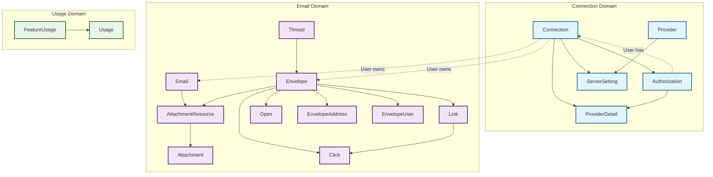
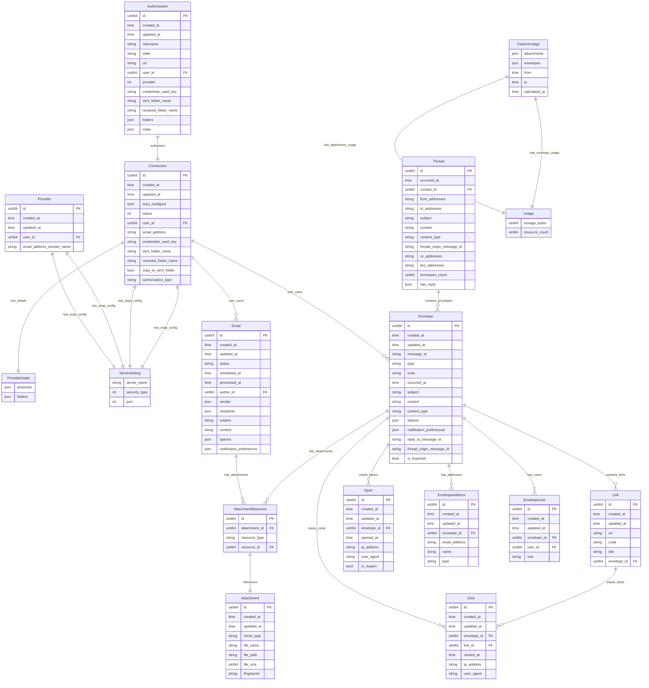
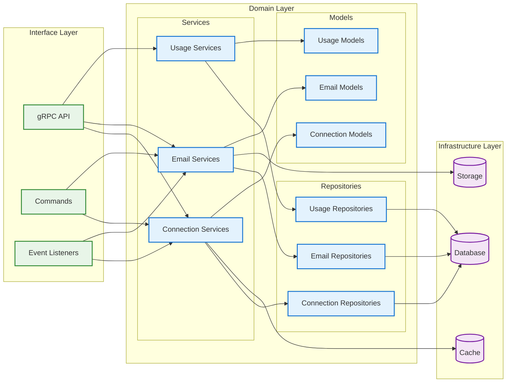

# Domain Models Dependency Diagram

  

This diagram represents the domain models and their relationships in the Digima Backend Email API, following Clean Architecture principles.

  

## Core Domain Models Structure

  

  

## Detailed Model Relationships

  

  

## Package Structure Overview

  

  

## Key Architectural Patterns

  

### 1. **Clean Architecture Separation**

  

- **Domain Layer**: Contains business logic and models

- **Infrastructure Layer**: Handles external dependencies (database, cache, storage)

- **Interface Layer**: Manages external communication (API, commands, events)

  

### 2. **Model Relationships**

  

- **Connection Domain**: Manages email provider connections and authentication

- **Email Domain**: Handles email processing, tracking, and threading

- **Usage Domain**: Tracks feature usage and resource consumption

  

### 3. **Polymorphic Relationships**

  

- `AttachmentResource` uses polymorphic associations with both `Email` and `Envelope`

- `ProviderDetail` stores flexible JSON configurations for different email providers

  

### 4. **Event-Driven Architecture**

  

- Models trigger domain events for cross-cutting concerns

- Listeners handle side effects and external integrations

  

### 5. **Repository Pattern**

  

- Each domain has its own repository interfaces

- Infrastructure implements concrete repository classes

- Services orchestrate business logic using repositories

  

This architecture ensures:

  

- **Separation of Concerns**: Each layer has a specific responsibility

- **Testability**: Business logic can be tested independently

- **Flexibility**: External dependencies can be easily swapped

- **Maintainability**: Clear boundaries between different parts of the system