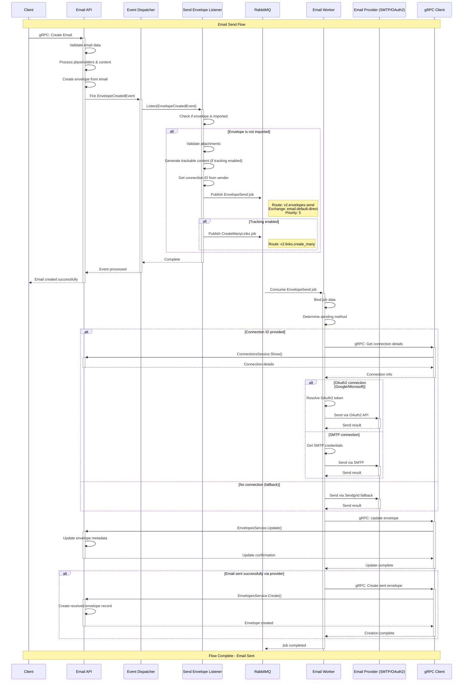
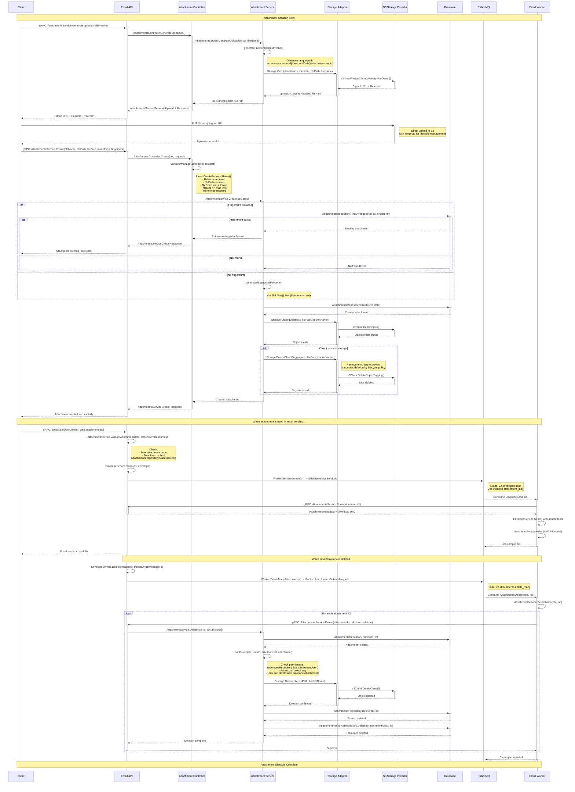

Create email

```mermaid
sequenceDiagram
    participant Client
    participant EmailAPI as Email API
    participant EventDispatcher as Event Dispatcher
    participant SendListener as Send Envelope Listener
    participant RabbitMQ
    participant EmailWorker as Email Worker
    participant EmailProvider as Email Provider (SMTP/OAuth2)
    participant gRPCClient as gRPC Client

    Note over Client, gRPCClient: Email Send Flow

    %% 1. Client initiates email creation
    Client->>+EmailAPI: gRPC: Create Email
    EmailAPI->>EmailAPI: Validate email data
    EmailAPI->>EmailAPI: Process placeholders & content
    EmailAPI->>EmailAPI: Create envelope from email
    
    %% 2. Event-driven envelope creation
    EmailAPI->>+EventDispatcher: Fire EnvelopeCreatedEvent
    EventDispatcher->>+SendListener: Listen(EnvelopeCreatedEvent)
    
    %% 3. Envelope processing
    SendListener->>SendListener: Check if envelope is imported
    alt Envelope is not imported
        SendListener->>SendListener: Validate attachments
        SendListener->>SendListener: Generate trackable content (if tracking enabled)
        SendListener->>SendListener: Get connection ID from sender
        
        %% 4. Publish to RabbitMQ
        SendListener->>+RabbitMQ: Publish EnvelopeSend job
        Note right of RabbitMQ: Route: v2.envelopes.send<br/>Exchange: email.default.direct<br/>Priority: 5
        
        %% 5. Optional: Create tracking links
        alt Tracking enabled
            SendListener->>+RabbitMQ: Publish CreateManyLinks job
            Note right of RabbitMQ: Route: v2.links.create_many
        end
    end
    
    SendListener-->>-EventDispatcher: Complete
    EventDispatcher-->>-EmailAPI: Event processed
    EmailAPI-->>-Client: Email created successfully

    %% 6. Worker processes the job
    RabbitMQ->>+EmailWorker: Consume EnvelopeSend job
    EmailWorker->>EmailWorker: Bind job data
    EmailWorker->>EmailWorker: Determine sending method
    
    alt Connection ID provided
        EmailWorker->>+gRPCClient: gRPC: Get connection details
        gRPCClient->>+EmailAPI: ConnectionsService.Show()
        EmailAPI-->>-gRPCClient: Connection details
        gRPCClient-->>-EmailWorker: Connection info
        
        alt OAuth2 connection (Google/Microsoft)
            EmailWorker->>EmailWorker: Resolve OAuth2 token
            EmailWorker->>+EmailProvider: Send via OAuth2 API
            EmailProvider-->>-EmailWorker: Send result
        else SMTP connection
            EmailWorker->>EmailWorker: Get SMTP credentials
            EmailWorker->>+EmailProvider: Send via SMTP
            EmailProvider-->>-EmailWorker: Send result
        end
    else No connection (fallback)
        EmailWorker->>+EmailProvider: Send via Sendgrid fallback
        EmailProvider-->>-EmailWorker: Send result
    end
    
    %% 7. Update envelope status
    EmailWorker->>+gRPCClient: gRPC: Update envelope
    gRPCClient->>+EmailAPI: EnvelopesService.Update()
    EmailAPI->>EmailAPI: Update envelope metadata
    EmailAPI-->>-gRPCClient: Update confirmation
    gRPCClient-->>-EmailWorker: Update complete
    
    %% 8. Create envelope record (if sent via provider)
    alt Email sent successfully via provider
        EmailWorker->>+gRPCClient: gRPC: Create sent envelope
        gRPCClient->>+EmailAPI: EnvelopesService.Create()
        EmailAPI->>EmailAPI: Create received envelope record
        EmailAPI-->>-gRPCClient: Envelope created
        gRPCClient-->>-EmailWorker: Creation complete
    end
    
    EmailWorker-->>-RabbitMQ: Job completed

    Note over Client, gRPCClient: Flow Complete - Email Sent
```

Created Attachment

```mermaid
sequenceDiagram
    participant Client
    participant EmailAPI as Email API
    participant AttachmentController as Attachment Controller
    participant AttachmentService as Attachment Service
    participant StorageAdapter as Storage Adapter
    participant S3 as S3/Storage Provider
    participant Database as Database
    participant RabbitMQ
    participant EmailWorker as Email Worker

    Note over Client, EmailWorker: Attachment Creation Flow

    %% 1. Generate Upload URL
    Client->>+EmailAPI: gRPC: AttachmentsService.GenerateUploadUrl(fileName)
    EmailAPI->>+AttachmentController: AttachmentsController.GenerateUploadUrl()
    AttachmentController->>+AttachmentService: AttachmentService.GenerateUploadUrl(ctx, fileName)
    
    AttachmentService->>AttachmentService: generateFileIdentifier(authToken)
    Note right of AttachmentService: Generate unique path:<br/>accounts/{accountId}-{accountCode}/attachments/{uuid}
    
    AttachmentService->>+StorageAdapter: Storage.GetUploadUrl(ctx, identifier, filePath, fileName)
    StorageAdapter->>+S3: s3.NewPresignClient().PresignPutObject()
    S3-->>-StorageAdapter: Signed URL + Headers
    StorageAdapter-->>-AttachmentService: uploadUrl, signedHeaders, filePath
    
    AttachmentService-->>-AttachmentController: url, signedHeader, filePath
    AttachmentController-->>-EmailAPI: AttachmentsServiceGenerateUploadUrlResponse
    EmailAPI-->>-Client: Upload URL + Headers + FilePath

    %% 2. Client Uploads File
    Client->>+S3: PUT file using signed URL
    Note right of S3: Direct upload to S3<br/>with temp tag for lifecycle management
    S3-->>-Client: Upload successful

    %% 3. Create Attachment Record
    Client->>+EmailAPI: gRPC: AttachmentsService.Create(fileName, filePath, fileSize, mimeType, fingerprint)
    EmailAPI->>+AttachmentController: AttachmentsController.Create(ctx, request)
    
    AttachmentController->>AttachmentController: ValidatorManager.Bind(form, request)
    Note right of AttachmentController: forms.CreateRequest.Rules():<br/>- fileName required<br/>- filePath required<br/>- fileExtension allowed<br/>- fileSize <= max limit<br/>- mimeType required
    
    AttachmentController->>+AttachmentService: AttachmentService.Create(ctx, args)
    
    alt Fingerprint provided
        AttachmentService->>+Database: AttachmentsRepository.FindByFingerprint(ctx, fingerprint)
        alt Attachment exists
            Database-->>-AttachmentService: Existing attachment
            AttachmentService-->>AttachmentController: Return existing attachment
            AttachmentController-->>EmailAPI: AttachmentsServiceCreateResponse
            EmailAPI-->>Client: Attachment created (duplicate)
        else Not found
            Database-->>AttachmentService: NotFoundError
        end
    else No fingerprint
        AttachmentService->>AttachmentService: generateFingerprint(fileName)
        Note right of AttachmentService: sha256.New().Sum(fileName + uuid)
    end
    
    AttachmentService->>+Database: AttachmentsRepository.Create(ctx, data)
    Database-->>-AttachmentService: Created attachment
    
    AttachmentService->>+StorageAdapter: Storage.ObjectExists(ctx, filePath, bucketName)
    StorageAdapter->>+S3: s3Client.HeadObject()
    S3-->>-StorageAdapter: Object exists status
    StorageAdapter-->>-AttachmentService: Object exists
    
    alt Object exists in storage
        AttachmentService->>+StorageAdapter: Storage.DeleteObjectTagging(ctx, filePath, bucketName)
        Note right of StorageAdapter: Remove temp tag to prevent<br/>automatic deletion by lifecycle policy
        StorageAdapter->>+S3: s3Client.DeleteObjectTagging()
        S3-->>-StorageAdapter: Tags deleted
        StorageAdapter-->>-AttachmentService: Tags removed
    end
    
    AttachmentService-->>-AttachmentController: Created attachment
    AttachmentController-->>-EmailAPI: AttachmentsServiceCreateResponse
    EmailAPI-->>-Client: Attachment created successfully

    %% 4. Attachment Usage in Email
    Note over Client, EmailWorker: When attachment is used in email sending...
    
    Client->>+EmailAPI: gRPC: EmailsService.Create() with attachmentIds[]
    EmailAPI->>EmailAPI: AttachmentService.validateAttachments(ctx, attachmentResources)
    Note right of EmailAPI: Check:<br/>- Max attachment count<br/>- Total file size limit<br/>AttachmentsRepository.SumFileSize()
    
    EmailAPI->>EmailAPI: EnvelopeService.Send(ctx, envelope)
    EmailAPI->>+RabbitMQ: Worker.SendEnvelope() → Publish EnvelopeSend job
    Note right of RabbitMQ: Route: v2.envelopes.send<br/>Job includes attachment_ids[]
    
    RabbitMQ->>+EmailWorker: Consume EnvelopeSend job
    EmailWorker->>+EmailAPI: gRPC: AttachmentsService.Show(attachmentId)
    EmailAPI-->>-EmailWorker: Attachment metadata + download URL
    EmailWorker->>EmailWorker: EnvelopeService.Send() with attachments
    EmailWorker->>EmailWorker: Send email via provider (SMTP/OAuth2)
    EmailWorker-->>-RabbitMQ: Job completed
    EmailAPI-->>-Client: Email sent successfully

    %% 5. Attachment Cleanup
    Note over EmailAPI, EmailWorker: When email/envelope is deleted...
    
    EmailAPI->>EmailAPI: EnvelopeService.DeleteThread(ctx, threadOriginMessageId)
    EmailAPI->>+RabbitMQ: Worker.DeleteManyAttachments() → Publish AttachmentsDeleteMany job
    Note right of RabbitMQ: Route: v2.attachments.delete_many
    
    RabbitMQ->>+EmailWorker: Consume AttachmentsDeleteMany job
    EmailWorker->>EmailWorker: AttachmentService.DeleteMany(ctx, job)
    
    loop For each attachment ID
        EmailWorker->>+EmailAPI: gRPC: AttachmentsService.Delete(attachmentId, isAuthorized=true)
        EmailAPI->>+AttachmentService: AttachmentService.Delete(ctx, id, isAuthorized)
        
        AttachmentService->>+Database: AttachmentsRepository.Show(ctx, id)
        Database-->>-AttachmentService: Attachment details
        
        AttachmentService->>AttachmentService: canDelete(ctx, userId, isAuthorized, attachment)
        Note right of AttachmentService: Check permissions:<br/>EnvelopesRepository.ExistsEnvelopeUser()<br/>- Admin can delete any<br/>- User can delete own envelope attachments
        
        AttachmentService->>+StorageAdapter: Storage.Delete(ctx, filePath, bucketName)
        StorageAdapter->>+S3: s3Client.DeleteObject()
        S3-->>-StorageAdapter: Object deleted
        StorageAdapter-->>-AttachmentService: Deletion confirmed
        
        AttachmentService->>+Database: AttachmentsRepository.Delete(ctx, id)
        Database-->>-AttachmentService: Record deleted
        
        AttachmentService->>+Database: AttachmentResourceRepository.DeleteByAttachmentId(ctx, id)
        Database-->>-AttachmentService: Resources deleted
        
        AttachmentService-->>-EmailAPI: Deletion complete
        EmailAPI-->>-EmailWorker: Success
    end
    
    EmailWorker-->>-RabbitMQ: Cleanup completed

    Note over Client, EmailWorker: Attachment Lifecycle Complete
```