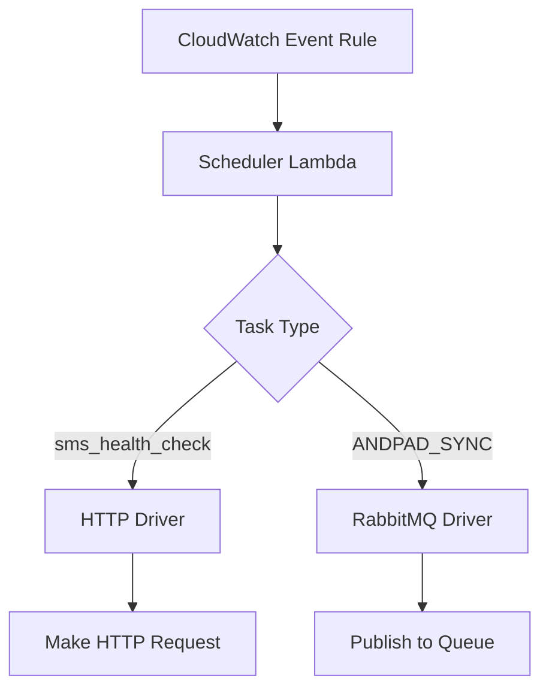

```mermaid
graph TD
    A[CloudWatch Event Rule] --> B[Scheduler Lambda]
    B --> C{Task Type}
    C -->|sms_health_check| D[HTTP Driver]
    C -->|ANDPAD_SYNC| E[RabbitMQ Driver]
    D --> F[Make HTTP Request]
    E --> G[Publish to Queue]
```

