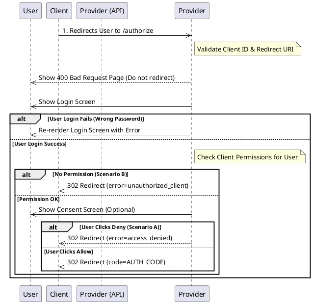

```plantuml
@startuml
    participant User
    participant Client
    participant "Provider (API)"

    Client->>Provider: 1. Redirects User to /authorize
    Note right of Provider: Validate Client ID & Redirect URI
    
    alt Invalid Client/Redirect URI
        Provider-->>User: Show 400 Bad Request Page (Do not redirect)
    else Valid Client
        Provider->>User: Show Login Screen
        
        alt User Login Fails (Wrong Password)
            Provider-->>User: Re-render Login Screen with Error
        else User Login Success
            Note right of Provider: Check Client Permissions for User
            
            alt No Permission (Scenario B)
                Provider-->>Client: 302 Redirect (error=unauthorized_client)
            else Permission OK
                Provider->>User: Show Consent Screen (Optional)
                
                alt User Clicks Deny (Scenario A)
                    Provider-->>Client: 302 Redirect (error=access_denied)
                else User Clicks Allow
                    Provider-->>Client: 302 Redirect (code=AUTH_CODE)
                end
            end
        end
@enduml
```