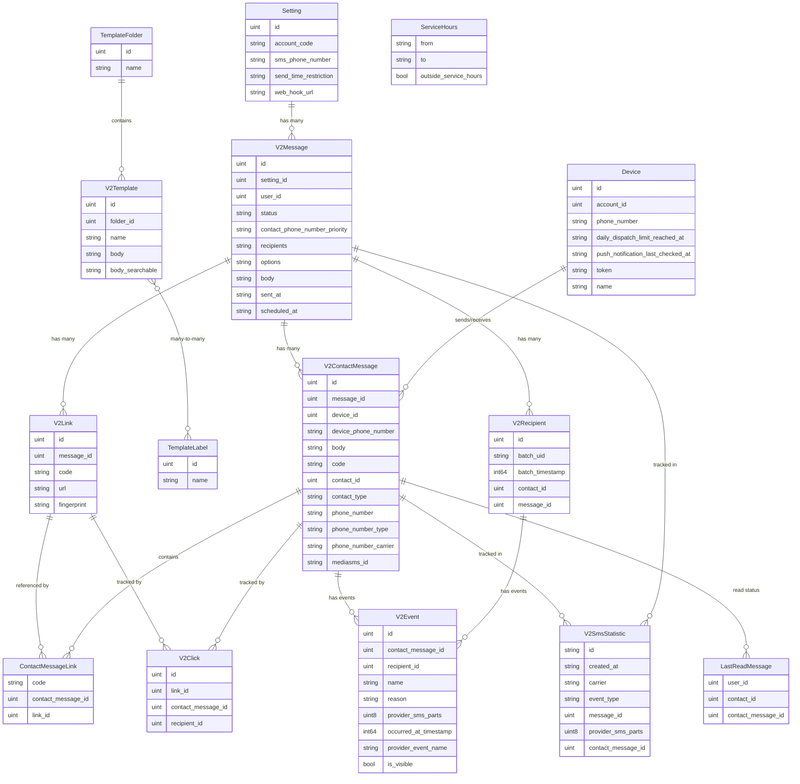

- [ ] # Digima Backend SMS API - Domain Models Dependencies Diagram

  

## Overview

  

This diagram shows the relationships and dependencies between all models in the `domain/models` directory of the Digima Backend SMS API.

## Entity Relationship Diagram

  

  

## Dependency Analysis

  

### Core Message Flow

  

1. **V2Message** is the central entity representing SMS messages

2. **V2ContactMessage** represents individual message instances sent to contacts

3. **V2Recipient** tracks unique contacts per message batch

4. **Setting** provides configuration for message sending

  

### Device Management

  

- **Device** represents SMS-capable devices with phone numbers

- Connected to **V2ContactMessage** for tracking which device sent/received messages

  

### Template System

  

- **V2Template** provides reusable message templates

- **TemplateFolder** organizes templates hierarchically

- **TemplateLabel** allows tagging templates for categorization

  

### Link Tracking

  

- **V2Link** represents URLs within messages

- **ContactMessageLink** connects links to specific contact messages

- **V2Click** tracks when recipients click on links

  

### Event System

  

- **V2Event** tracks the lifecycle of SMS messages (queued, sent, delivered, etc.)

- Connected to both **V2ContactMessage** and **V2Recipient**

  

### Statistics and Analytics

  

- **V2SmsStatistic** stores aggregated statistics in MongoDB

- Tracks various event types and carrier information

  

### Utility Models

  

- **ServiceHours** defines operational time windows

- **LastReadMessage** tracks user read status

  

## Key Dependencies

  

### Strong Dependencies (Foreign Keys)

  

- V2ContactMessage → V2Message (message_id)

- V2ContactMessage → Device (device_id)

- V2Message → Setting (setting_id)

- V2Link → V2Message (message_id)

- V2Click → V2Link (link_id)

- V2Click → V2ContactMessage (contact_message_id)

- V2Event → V2ContactMessage (contact_message_id)

- V2Recipient → V2Message (message_id)

- V2Template → TemplateFolder (folder_id)

  

### Many-to-Many Relationships

  

- V2Template ↔ TemplateLabel (via pivot table)

  

### Weak Dependencies (References)

  

- V2SmsStatistic references V2Message and V2ContactMessage

- LastReadMessage references V2ContactMessage

  

## Database Considerations

  

### Primary Database (MySQL/PostgreSQL)

  

- Most entities use GORM with soft deletes

- Standard timestamps (created_at, updated_at, deleted_at)

- Foreign key constraints for data integrity

  

### MongoDB Integration

  

- V2SmsStatistic uses MongoDB for analytics

- Implements custom collection and document management

  

### Indexing Strategy

  

- Primary keys on all entities

- Foreign key indexes for performance

- Composite indexes for query optimization

  

## Clean Architecture Compliance

  

This model structure follows Clean Architecture principles:

  

1. **Domain Layer**: All models are in the domain layer

2. **Dependency Direction**: Dependencies point inward toward domain

3. **Entity Independence**: Models are independent of external concerns

4. **Business Logic**: Core business rules are encapsulated in model methods

  

## Usage Patterns

  

### Message Creation Flow

  

1. Create V2Message with Setting

2. Generate V2Recipient records

3. Create V2ContactMessage instances

4. Generate V2Link records if URLs present

5. Track events via V2Event

6. Record statistics in V2SmsStatistic

  

### Template Usage

  

1. Organize templates in TemplateFolder

2. Tag templates with TemplateLabel

3. Use templates to create V2Message instances

  

### Analytics and Reporting

  

1. V2Event provides real-time status tracking

2. V2SmsStatistic provides aggregated analytics

3. V2Click provides engagement metrics