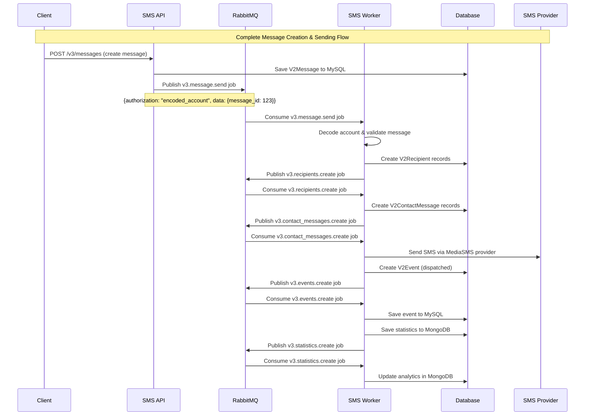
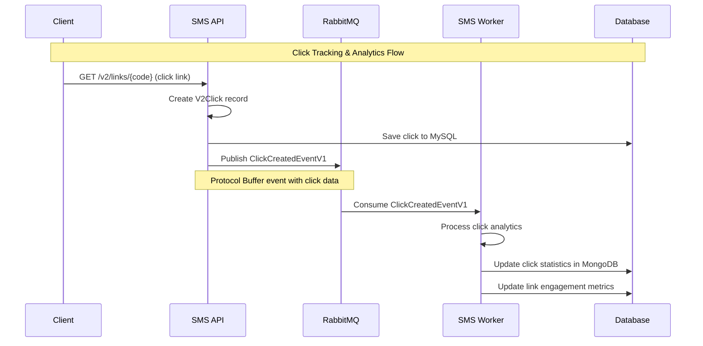
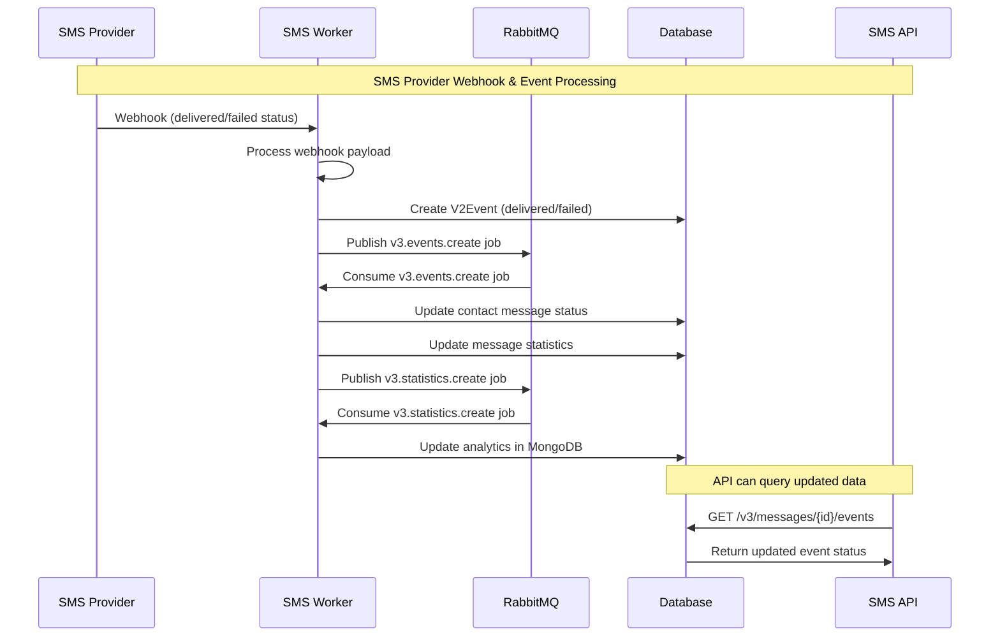
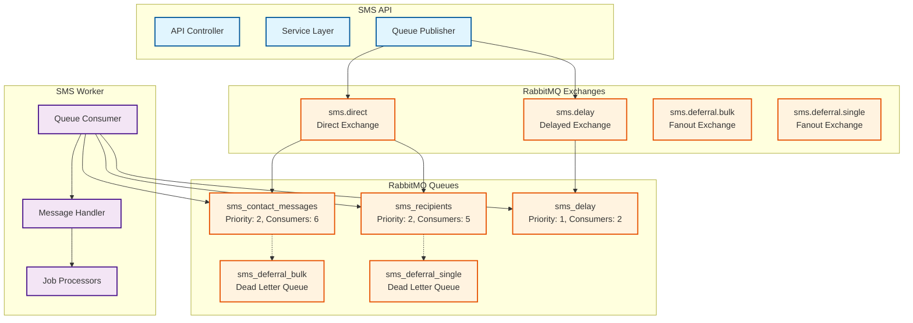
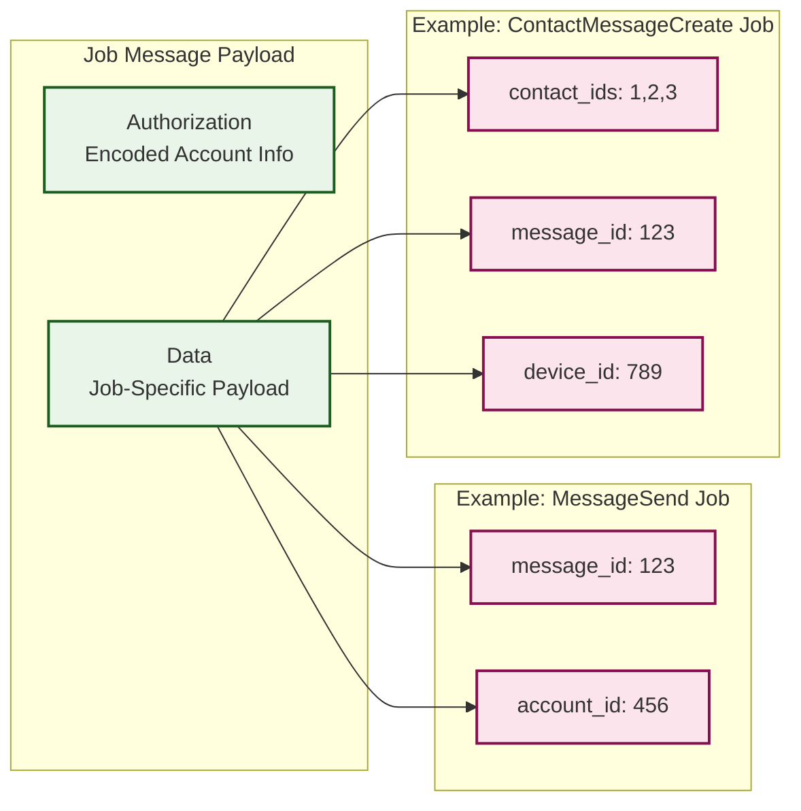

# Digima Backend SMS API & Worker Dependencies Diagram
## Overview
This diagram visualizes the dependencies and relationships between the SMS API and SMS Worker projects in the Digima Backend SMS system.
## System Architecture Diagram

```mermaid

graph TB

%% External Systems

subgraph "External Systems"

SMS_PROVIDER[SMS Provider<br/>MediaSMS]

REDIS[Redis Cache]

MYSQL[(MySQL Database)]

MONGODB[(MongoDB Analytics)]

RABBITMQ[RabbitMQ Message Queue]

DYNAMODB[(DynamoDB)]

FIREBASE[Firebase]

end

  

%% SMS API Project

subgraph "SMS API (digima-backend-sms-api)"

API_MAIN[main.go]

  

subgraph "API Controllers"

V2_CONTROLLERS[V2 Controllers<br/>Legacy API]

V3_CONTROLLERS[V3 Controllers<br/>New API]

end

  

subgraph "API Services"

MESSAGE_SERVICE[Message Service]

CONTACT_SERVICE[Contact Message Service]

EVENT_SERVICE[Event Service]

SETTING_SERVICE[Setting Service]

TEMPLATE_SERVICE[Template Service]

end

  

subgraph "API Domain"

API_MODELS[Domain Models]

API_JOBS[Job Definitions]

API_REPOS[Repositories]

end

  

subgraph "API Infrastructure"

API_DB[Database Layer]

API_CACHE[Cache Layer]

API_QUEUE[Queue Publisher]

end

end

  

%% SMS Worker Project

subgraph "SMS Worker (digima-backend-sms-worker)"

WORKER_MAIN[main.go]

  

subgraph "Worker Commands"

SERVE_CMD[serve command]

DB_MIGRATE_CMD[db:migrate command]

FAILED_JOBS_CMD[failed:jobs command]

end

  

subgraph "Worker Queue Handlers"

MESSAGE_HANDLER[Message Handler]

CONTACT_HANDLER[Contact Message Handler]

EVENT_HANDLER[Event Handler]

RECIPIENT_HANDLER[Recipient Handler]

STATISTICS_HANDLER[Statistics Handler]

end

  

subgraph "Worker Services"

SMS_FORWARDER[SMS Forwarder]

PROCESSOR[Message Processor]

PUBLISHER[Queue Publisher]

end

  

subgraph "Worker Infrastructure"

WORKER_DB[Database Layer]

WORKER_CACHE[Cache Layer]

WORKER_QUEUE[Queue Consumer]

end

end

  

%% Shared Proto Project

subgraph "Shared Proto (digima-backend-sms-proto)"

PROTO_FILES[Protocol Buffer Files]

CLICK_EVENT[ClickCreatedEventV1]

end

  

%% Dependencies and Relationships

%% API to External

API_MAIN --> V2_CONTROLLERS

API_MAIN --> V3_CONTROLLERS

V2_CONTROLLERS --> MESSAGE_SERVICE

V3_CONTROLLERS --> MESSAGE_SERVICE

MESSAGE_SERVICE --> API_MODELS

MESSAGE_SERVICE --> API_JOBS

API_JOBS --> API_QUEUE

API_QUEUE --> RABBITMQ

  

%% Worker to External

WORKER_MAIN --> SERVE_CMD

SERVE_CMD --> MESSAGE_HANDLER

MESSAGE_HANDLER --> CONTACT_HANDLER

MESSAGE_HANDLER --> EVENT_HANDLER

MESSAGE_HANDLER --> RECIPIENT_HANDLER

MESSAGE_HANDLER --> STATISTICS_HANDLER

WORKER_QUEUE --> RABBITMQ

  

%% Shared Dependencies

API_MODELS -.-> PROTO_FILES

WORKER_SERVICES -.-> PROTO_FILES

CLICK_EVENT --> API_MODELS

CLICK_EVENT --> WORKER_SERVICES

  

%% Database Dependencies

API_DB --> MYSQL

API_DB --> MONGODB

WORKER_DB --> MYSQL

WORKER_DB --> DYNAMODB

  

%% Cache Dependencies

API_CACHE --> REDIS

WORKER_CACHE --> REDIS

  

%% SMS Provider

SMS_FORWARDER --> SMS_PROVIDER

  

%% Firebase

WORKER_SERVICES --> FIREBASE

  

%% Styling

classDef apiClass fill:#e1f5fe,stroke:#01579b,stroke-width:2px

classDef workerClass fill:#f3e5f5,stroke:#4a148c,stroke-width:2px

classDef externalClass fill:#fff3e0,stroke:#e65100,stroke-width:2px

classDef protoClass fill:#e8f5e8,stroke:#1b5e20,stroke-width:2px

  

class API_MAIN,V2_CONTROLLERS,V3_CONTROLLERS,MESSAGE_SERVICE,CONTACT_SERVICE,EVENT_SERVICE,SETTING_SERVICE,TEMPLATE_SERVICE,API_MODELS,API_JOBS,API_REPOS,API_DB,API_CACHE,API_QUEUE apiClass

class WORKER_MAIN,SERVE_CMD,DB_MIGRATE_CMD,FAILED_JOBS_CMD,MESSAGE_HANDLER,CONTACT_HANDLER,EVENT_HANDLER,RECIPIENT_HANDLER,STATISTICS_HANDLER,SMS_FORWARDER,PROCESSOR,PUBLISHER,WORKER_DB,WORKER_CACHE,WORKER_QUEUE workerClass

class SMS_PROVIDER,REDIS,MYSQL,MONGODB,RABBITMQ,DYNAMODB,FIREBASE externalClass

class PROTO_FILES,CLICK_EVENT protoClass

```

  

## Detailed Communication Flow
### 1. Message Creation Flow

### 2. Click Tracking Flow

  

### 3. Event Processing Flow

  

### 4. Queue Architecture & Message Routing

  

  

### 5. Job Message Structure

## Job Types and Routes

  

### V2 Jobs (Legacy)

| Job Type                   | Route                           | Description                |
| -------------------------- | ------------------------------- | -------------------------- |
| ProcessContactMessages     | `process_contact_messages`      | Process contact messages   |
| CreateActivities           | `create_activities`             | Create activity records    |
| CreateEvents               | `create_events`                 | Create event records       |
| CreateStatistics           | `create_statistics`             | Create statistics          |
| UpdateContact              | `update_contact`                | Update contact information |
| PreprocessBulkContacts     | `preprocess_bulk_contact`       | Preprocess bulk contacts   |
| PreprocessBulkContactGroup | `preprocess_bulk_contact_group` | Preprocess contact groups  |
| SendSmsMessage             | `send_sms_message`              | Send SMS message           |
| UpdateSmsMessage           | `update_sms_message`            | Update SMS message         |
### V3 Jobs (New)

| Job Type                     | Route                                | Description                       |
| ---------------------------- | ------------------------------------ | --------------------------------- |
| EventsCreate                 | `v3.events.create`                   | Create events (V3)                |
| ContactMessageCreate         | `v3.contact_messages.create`         | Create contact messages (V3)      |
| DeviceContactCreate          | `v3.device_contact.create`           | Create device contact             |
| DeviceContactDelete          | `v3.device_contact.delete`           | Delete device contact             |
| MessageSend                  | `v3.message.send`                    | Send message (V3)                 |
| MessageScheduledSend         | `v3.message.scheduled_send`          | Send scheduled message            |
| RecipientsCreate             | `v3.recipients.create`               | Create recipients                 |
| RecipientsDispatch           | `v3.recipients.dispatch`             | Dispatch recipients               |
| StatisticsCreate             | `v3.statistics.create`               | Create statistics (V3)            |
| WorkflowContactMessageCreate | `v3.workflow_contact_message.create` | Workflow contact message creation |
| WorkflowEventCreate          | `v3.workflow_event.create`           | Workflow event creation           |
| WorkflowMessageSend          | `v3.workflow_message.send`           | Workflow message sending          |
| WorkflowRecipientCreate      | `v3.workflow_recipient.create`       | Workflow recipient creation       |

  

## Queue Configuration

  

### Exchanges
- **sms.direct**: Direct exchange for immediate processing
- **sms.delay**: Delayed message exchange for scheduled tasks
- **sms.deferral.bulk**: Fanout exchange for bulk deferral
- **sms.deferral.single**: Fanout exchange for single deferral
### Queues
- **sms_contact_messages**: High priority (2), 6 consumers
- **sms_recipients**: High priority (2), 5 consumers
- **sms_delay**: Low priority (1), 2 consumers
- **sms_deferral_bulk**: Dead letter queue for bulk messages
- **sms_deferral_single**: Dead letter queue for single messages
## Shared Dependencies
### Common Libraries

- `github.com/comvex-jp/backend-service-go-framework/v6`: Core framework
- `github.com/comvex-jp/digima-backend-client-go/v5`: Client library
- `github.com/comvex-jp/mediasms-go`: SMS provider integration
- `github.com/streadway/amqp`: RabbitMQ client
- `gorm.io/gorm`: ORM framework
### Database Access

- **SMS API**: MySQL (primary), MongoDB (analytics)
- **SMS Worker**: MySQL (primary), DynamoDB (worker-specific)
### Cache Layer

- **Redis**: Shared cache for both API and Worker
- **FreeCache**: In-memory cache for worker

## Communication Patterns

### 1. Synchronous Communication
- API → Database: Direct database operations
- API → Cache: Direct cache operations
- Worker → Database: Direct database operations

### 2. Asynchronous Communication

- API → Worker: Via RabbitMQ message queues
- Worker → Worker: Internal job processing
- Worker → External Services: SMS provider, Firebase
### 3. Event-Driven Communication
- Click events via Protocol Buffers
- Statistics aggregation
- Real-time notifications
## Key Differences

### SMS API
- **Purpose**: HTTP API endpoints for client interaction
- **Architecture**: RESTful API with controllers, services, repositories
- **Database**: MySQL + MongoDB
- **Role**: Message creation, configuration, querying
### SMS Worker
- **Purpose**: Background job processing and SMS delivery
- **Architecture**: Queue consumer with job handlers
- **Database**: MySQL + DynamoDB
- **Role**: Message processing, SMS sending, event handling
## Deployment Considerations

### Scaling
- **API**: Horizontal scaling via load balancers
- **Worker**: Horizontal scaling via multiple worker instances
- **Queues**: Multiple consumers per queue type
### Monitoring

- **API**: HTTP metrics, response times, error rates
- **Worker**: Queue depth, processing times, failure rates
- **Shared**: Database performance, cache hit rates
### Data Consistency

- **Eventual Consistency**: Between API and Worker via queues
- **Strong Consistency**: Within each service's database
- **Caching**: Redis for frequently accessed data