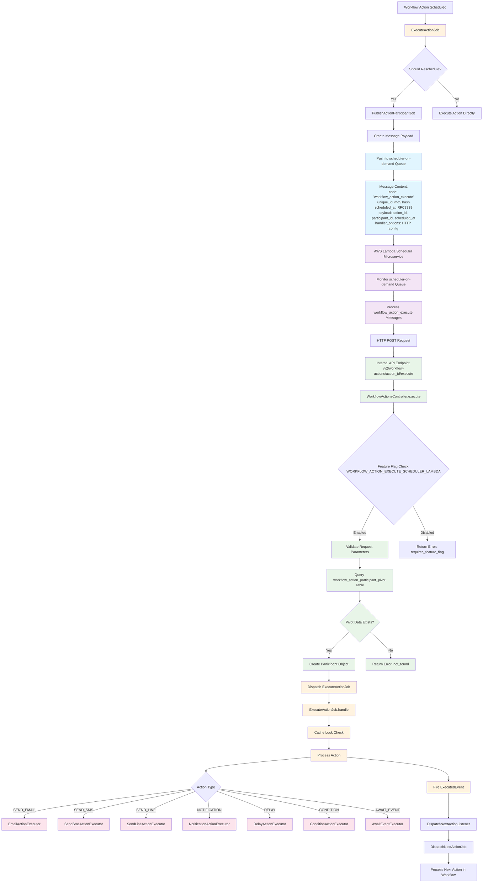

# Workflow Action Execute Trigger Message Flow

  



  

## Detailed Flow Description

  

### 1. **Workflow Action Scheduling**

  

- When a workflow action needs to be scheduled, `ExecuteActionJob` checks if it should be rescheduled

- If rescheduling is needed, `PublishActionParticipantJob` is dispatched

  

### 2. **Message Production**

  

- `PublishActionParticipantJob` creates a message with:

- `code: 'workflow_action_execute'`

- `unique_id: md5 hash of the message`

- `scheduled_at: RFC3339 timestamp`

- `payload: action_id, participant_id, scheduled_at`

- `handler_options: HTTP configuration for internal API call`

  

### 3. **Queue Publishing**

  

- Message is pushed to `scheduler-on-demand` queue using AWS SQS

- Queue message ID is logged for tracking

  

### 4. **External Lambda Consumer**

  

- AWS Lambda scheduler microservice monitors the `scheduler-on-demand` queue

- Processes messages with `code: 'workflow_action_execute'`

- Extracts handler options and makes HTTP request

  

### 5. **Internal API Processing**

  

- Lambda makes HTTP POST request to `/v2/workflow-actions/{action_id}/execute`

- `WorkflowActionsController.execute()` handles the request

- Validates feature flag `WORKFLOW_ACTION_EXECUTE_SCHEDULER_LAMBDA`

- Validates request parameters (`participant_id`, `scheduled_at`)

  

### 6. **Database Validation**

  

- Queries `workflow_action_participant_pivot` table

- Validates that the action/participant combination exists and is not processed

- Creates a `Participant` object for execution

  

### 7. **Action Execution**

  

- Dispatches `ExecuteActionJob` with action and participant

- `ExecuteActionJob` uses cache locking to prevent duplicate executions

- Processes the action based on its type (email, SMS, LINE, etc.)

  

### 8. **Action Type Execution**

  

- Different executors handle different action types:

- `EmailActionExecutor`: Sends emails

- `SendSmsActionExecutor`: Sends SMS

- `SendLineActionExecutor`: Sends LINE messages

- `NotificationActionExecutor`: Sends notifications

- `DelayActionExecutor`: Handles delays

- `ConditionActionExecutor`: Handles conditions

- `AwaitEventExecutor`: Waits for events

  

### 9. **Event Handling**

  

- After execution, `ExecutedEvent` is fired

- `DispatchNextActionListener` handles the event

- `DispatchNextActionJob` processes the next action in the workflow

  

## Key Components

  

### Queue Configuration

  

```php

// config/queue.php

'scheduler-on-demand' => [

'driver' => 'sqs',

'queue' => $queueConfig['queue_name_prefix'].'scheduler-on-demand',

]

```

  

### Feature Flag

  

```php

// app/Models/Core/FeatureFlag.php

public const FEATURE_FLAG_WORKFLOW_ACTION_EXECUTE_SCHEDULER_LAMBDA = 'WORKFLOW_ACTION_EXECUTE_SCHEDULER_LAMBDA';

```

  

### Message Structure

  

```json

{

"code": "workflow_action_execute",

"unique_id": "md5_hash_of_message",

"scheduled_at": "2024-01-01T10:00:00Z",

"payload": {

"action_id": 123,

"participant_id": 456,

"scheduled_at": "2024-01-01 10:00:00"

},

"handler_options": {

"driver": "http",

"headers": {

"Content-Type": "application/json",

"Authorization": "Bearer {client_code}",

"DGM-ACCOUNT-ID": "account_id"

},

"method": "POST",

"url": "https://api.internal/v2/workflow-actions/123/execute"

}

}

```

  

## Error Handling

  

1. **Feature Flag Disabled**: Returns `requires_feature_flag_workflow_action_execute_scheduler_lambda`

2. **Invalid Pivot Data**: Returns `not_found`

3. **Duplicate Execution**: Cache lock prevents multiple executions

4. **Queue Failures**: Retry mechanism with exponential backoff

5. **HTTP Failures**: Lambda retry mechanism for failed API calls