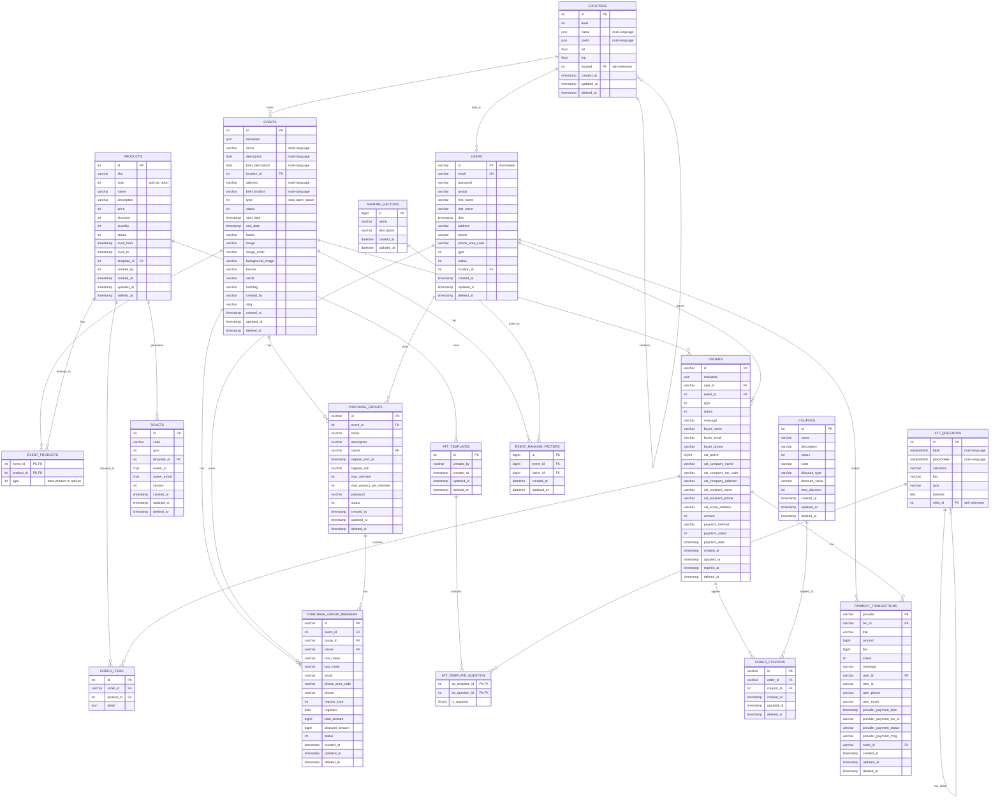

# Database Schema Analysis

  

## Overview

  

This document provides a comprehensive analysis of the API Ticket database schema, including entity relationships, identified problems, and suggested enhancements.

  

## Entity Relationship Diagram

  



  

## Identified Problems

  

### 1. **Data Type Inconsistencies**

  

#### Problem: Mixed data types for similar fields

- **User IDs**: `VARCHAR(255)` in users table vs `CHAR(127)` in tickets table

- **Event IDs**: `INT` in events table vs `BIGINT` in event_ranking_factors

- **Timestamps**: Mix of `timestamp` and `datetime(3)` across tables

  

#### Impact:

- Potential data truncation

- Foreign key constraint issues

- Query performance problems

  

### 2. **Missing Foreign Key Constraints**

  

#### Problem: Incomplete referential integrity

- `events.location_id` → `locations.id` (missing FK)

- `users.location_id` → `locations.id` (missing FK)

- `tickets.owner_id` → `users.id` (missing FK)

- `tickets.template_id` → `att_templates.id` (missing FK)

- `purchase_group_members.owner` → `users.id` (missing FK)

  

#### Impact:

- Data integrity issues

- Orphaned records

- Difficult to maintain data consistency

  

### 3. **Inconsistent Multi-language Implementation**

  

#### Problem: Different approaches for multi-language content

- `events.name`: `varchar(255)` with comment "multi language"

- `events.description`: `BLOB` with comment "multi language"

- `locations.name`: `json` with comment "multi language"

- `att_questions.label`: `MEDIUMBLOB` with comment "multi language"

  

#### Impact:

- Inconsistent data storage

- Difficult to query and index

- Performance issues with BLOB fields

  

### 4. **Poor Indexing Strategy**

  

#### Problem: Missing indexes on frequently queried fields

- No indexes on `events.start_date`, `events.end_date`

- No indexes on `orders.created_at`, `orders.status`

- No indexes on `tickets.owner_id`, `tickets.code`

- No composite indexes for common query patterns

  

#### Impact:

- Slow query performance

- Poor user experience

- High database load

  

### 5. **Incomplete Ticket Management**

  

#### Problem: Limited ticket information

- `tickets` table lacks essential fields like `order_id`, `product_id`, `event_id`

- No relationship between tickets and orders

- Missing ticket status and validation fields

  

#### Impact:

- Difficult to track ticket lifecycle

- Poor audit trail

- Limited reporting capabilities

  

### 6. **VAT Information Duplication**

  

#### Problem: VAT fields duplicated in orders table

- `vat_company_name`, `vat_company_tax_code`, `vat_company_address`

- `vat_recipient_name`, `vat_recipient_phone`, `vat_email_address`

  

#### Impact:

- Data redundancy

- Inconsistent VAT information

- Difficult to maintain

  

### 7. **Inconsistent Status Enums**

  

#### Problem: Status fields without clear documentation

- `events.status`: `INT` (no enum values documented)

- `orders.status`: `INT` (no enum values documented)

- `products.status`: `INT` (no enum values documented)

- `tickets.status`: Missing entirely

  

#### Impact:

- Unclear business logic

- Difficult to maintain

- Potential data inconsistencies

  

### 8. **Missing Audit Trail**

  

#### Problem: Incomplete audit information

- Some tables missing `created_by`, `updated_by` fields

- No tracking of who made changes

- Limited change history

  

#### Impact:

- Poor compliance

- Difficult debugging

- Limited accountability

  

## Suggested Enhancements

  

### 1. **Standardize Data Types**

  

```sql

-- Standardize ID fields

ALTER TABLE tickets MODIFY COLUMN owner_id VARCHAR(255);

ALTER TABLE event_ranking_factors MODIFY COLUMN event_id INT;

  

-- Standardize timestamps

ALTER TABLE ranking_factors MODIFY COLUMN created_at TIMESTAMP DEFAULT CURRENT_TIMESTAMP;

ALTER TABLE ranking_factors MODIFY COLUMN updated_at TIMESTAMP DEFAULT CURRENT_TIMESTAMP ON UPDATE CURRENT_TIMESTAMP;

```

  

### 2. **Add Missing Foreign Key Constraints**

  

```sql

-- Add foreign key constraints

ALTER TABLE events ADD CONSTRAINT fk_events_location

FOREIGN KEY (location_id) REFERENCES locations(id);

  

ALTER TABLE users ADD CONSTRAINT fk_users_location

FOREIGN KEY (location_id) REFERENCES locations(id);

  

ALTER TABLE tickets ADD CONSTRAINT fk_tickets_owner

FOREIGN KEY (owner_id) REFERENCES users(id);

  

ALTER TABLE tickets ADD CONSTRAINT fk_tickets_template

FOREIGN KEY (template_id) REFERENCES att_templates(id);

  

ALTER TABLE purchase_group_members ADD CONSTRAINT fk_pgm_owner

FOREIGN KEY (owner) REFERENCES users(id);

```

  

### 3. **Implement Consistent Multi-language Strategy**

  

```sql

-- Create a standardized multi-language table

CREATE TABLE translations (

id INT PRIMARY KEY AUTO_INCREMENT,

entity_type VARCHAR(50) NOT NULL, -- 'event', 'location', 'question'

entity_id INT NOT NULL,

field_name VARCHAR(50) NOT NULL, -- 'name', 'description', 'label'

language_code VARCHAR(10) NOT NULL,

translation_value TEXT NOT NULL,

created_at TIMESTAMP DEFAULT CURRENT_TIMESTAMP,

updated_at TIMESTAMP DEFAULT CURRENT_TIMESTAMP ON UPDATE CURRENT_TIMESTAMP,

UNIQUE KEY uk_translation (entity_type, entity_id, field_name, language_code),

INDEX idx_entity (entity_type, entity_id),

INDEX idx_language (language_code)

);

  

-- Migrate existing multi-language data

-- (Implementation depends on current data structure)

```

  

### 4. **Add Strategic Indexes**

  

```sql

-- Event indexes

CREATE INDEX idx_events_dates ON events(start_date, end_date);

CREATE INDEX idx_events_status ON events(status);

CREATE INDEX idx_events_type ON events(type);

CREATE INDEX idx_events_created_by ON events(created_by);

  

-- Order indexes

CREATE INDEX idx_orders_user_event ON orders(user_id, event_id);

CREATE INDEX idx_orders_status_date ON orders(status, created_at);

CREATE INDEX idx_orders_payment_status ON orders(payment_status);

  

-- Ticket indexes

CREATE INDEX idx_tickets_owner ON tickets(owner_id);

CREATE INDEX idx_tickets_code ON tickets(code);

CREATE INDEX idx_tickets_template ON tickets(template_id);

  

-- Purchase group indexes

CREATE INDEX idx_pg_event_owner ON purchase_groups(event_id, owner);

CREATE INDEX idx_pgm_group_owner ON purchase_group_members(group_id, owner);

```

  

### 5. **Enhance Ticket Management**

  

```sql

-- Add missing fields to tickets table

ALTER TABLE tickets

ADD COLUMN order_id VARCHAR(63) AFTER id,

ADD COLUMN product_id INT AFTER order_id,

ADD COLUMN event_id INT AFTER product_id,

ADD COLUMN status INT DEFAULT 1 AFTER type,

ADD COLUMN valid_from TIMESTAMP NULL,

ADD COLUMN valid_until TIMESTAMP NULL,

ADD COLUMN used_at TIMESTAMP NULL,

ADD COLUMN used_by VARCHAR(255) NULL,

ADD COLUMN qr_code VARCHAR(255) NULL,

ADD COLUMN barcode VARCHAR(255) NULL;

  

-- Add foreign key constraints

ALTER TABLE tickets ADD CONSTRAINT fk_tickets_order

FOREIGN KEY (order_id) REFERENCES orders(id);

ALTER TABLE tickets ADD CONSTRAINT fk_tickets_product

FOREIGN KEY (product_id) REFERENCES products(id);

ALTER TABLE tickets ADD CONSTRAINT fk_tickets_event

FOREIGN KEY (event_id) REFERENCES events(id);

```

  

### 6. **Create VAT Information Table**

  

```sql

CREATE TABLE vat_information (

id INT PRIMARY KEY AUTO_INCREMENT,

user_id VARCHAR(255) NOT NULL,

company_name VARCHAR(255),

company_tax_code VARCHAR(255),

company_address TEXT,

recipient_name VARCHAR(255),

recipient_phone VARCHAR(255),

email_address VARCHAR(255),

is_active BOOLEAN DEFAULT TRUE,

created_at TIMESTAMP DEFAULT CURRENT_TIMESTAMP,

updated_at TIMESTAMP DEFAULT CURRENT_TIMESTAMP ON UPDATE CURRENT_TIMESTAMP,

FOREIGN KEY (user_id) REFERENCES users(id),

INDEX idx_user_active (user_id, is_active)

);

  

-- Update orders table to reference VAT information

ALTER TABLE orders

ADD COLUMN vat_info_id INT AFTER user_id,

ADD CONSTRAINT fk_orders_vat_info

FOREIGN KEY (vat_info_id) REFERENCES vat_information(id);

```

  

### 7. **Create Status Enum Tables**

  

```sql

-- Create status enum tables

CREATE TABLE event_statuses (

id INT PRIMARY KEY,

name VARCHAR(50) NOT NULL,

description TEXT,

is_active BOOLEAN DEFAULT TRUE

);

  

CREATE TABLE order_statuses (

id INT PRIMARY KEY,

name VARCHAR(50) NOT NULL,

description TEXT,

is_active BOOLEAN DEFAULT TRUE

);

  

CREATE TABLE ticket_statuses (

id INT PRIMARY KEY,

name VARCHAR(50) NOT NULL,

description TEXT,

is_active BOOLEAN DEFAULT TRUE

);

  

-- Insert common statuses

INSERT INTO event_statuses (id, name, description) VALUES

(1, 'draft', 'Event is in draft mode'),

(2, 'published', 'Event is published and visible'),

(3, 'active', 'Event is active and accepting registrations'),

(4, 'completed', 'Event has been completed'),

(5, 'cancelled', 'Event has been cancelled');

  

INSERT INTO order_statuses (id, name, description) VALUES

(1, 'pending', 'Order is pending payment'),

(2, 'paid', 'Order has been paid'),

(3, 'cancelled', 'Order has been cancelled'),

(4, 'refunded', 'Order has been refunded'),

(5, 'expired', 'Order has expired');

```

  

### 8. **Add Comprehensive Audit Trail**

  

```sql

-- Add audit fields to all tables

ALTER TABLE events ADD COLUMN created_by VARCHAR(255) AFTER created_at;

ALTER TABLE events ADD COLUMN updated_by VARCHAR(255) AFTER updated_at;

  

ALTER TABLE orders ADD COLUMN created_by VARCHAR(255) AFTER created_at;

ALTER TABLE orders ADD COLUMN updated_by VARCHAR(255) AFTER updated_at;

  

ALTER TABLE products ADD COLUMN created_by VARCHAR(255) AFTER created_at;

ALTER TABLE products ADD COLUMN updated_by VARCHAR(255) AFTER updated_at;

  

-- Create audit log table

CREATE TABLE audit_logs (

id BIGINT PRIMARY KEY AUTO_INCREMENT,

table_name VARCHAR(100) NOT NULL,

record_id VARCHAR(255) NOT NULL,

action ENUM('INSERT', 'UPDATE', 'DELETE') NOT NULL,

old_values JSON NULL,

new_values JSON NULL,

changed_by VARCHAR(255) NOT NULL,

changed_at TIMESTAMP DEFAULT CURRENT_TIMESTAMP,

INDEX idx_table_record (table_name, record_id),

INDEX idx_changed_by (changed_by),

INDEX idx_changed_at (changed_at)

);

```

  

### 9. **Performance Optimizations**

  

```sql

-- Partition large tables by date

ALTER TABLE orders PARTITION BY RANGE (YEAR(created_at)) (

PARTITION p2023 VALUES LESS THAN (2024),

PARTITION p2024 VALUES LESS THAN (2025),

PARTITION p2025 VALUES LESS THAN (2026),

PARTITION p_future VALUES LESS THAN MAXVALUE

);

  

-- Add covering indexes for common queries

CREATE INDEX idx_orders_covering ON orders(user_id, event_id, status, created_at, amount);

CREATE INDEX idx_tickets_covering ON tickets(owner_id, event_id, status, created_at);

```

  

### 10. **Data Validation and Constraints**

  

```sql

-- Add check constraints

ALTER TABLE events ADD CONSTRAINT chk_event_dates

CHECK (start_date < end_date);

  

ALTER TABLE orders ADD CONSTRAINT chk_order_amount

CHECK (amount >= 0);

  

ALTER TABLE products ADD CONSTRAINT chk_product_price

CHECK (price >= 0);

  

ALTER TABLE tickets ADD CONSTRAINT chk_ticket_dates

CHECK (valid_from IS NULL OR valid_until IS NULL OR valid_from < valid_until);

```

  

## Implementation Priority

  

### **High Priority (Immediate)**

1. Add missing foreign key constraints

2. Standardize data types

3. Add strategic indexes

4. Enhance ticket management

  

### **Medium Priority (Next Sprint)**

1. Implement consistent multi-language strategy

2. Create VAT information table

3. Add status enum tables

4. Add audit trail

  

### **Low Priority (Future)**

1. Performance optimizations (partitioning)

2. Advanced data validation

3. Additional covering indexes

  

## Conclusion

  

The current database schema has evolved over time and shows signs of organic growth without comprehensive planning. While functional, it has several areas for improvement in terms of data integrity, performance, and maintainability. The suggested enhancements will significantly improve the robustness and scalability of the system while maintaining backward compatibility.